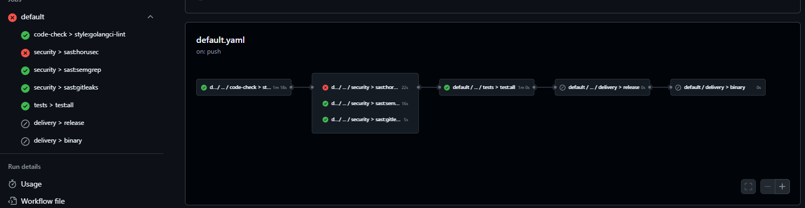
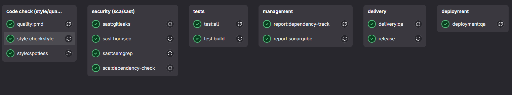
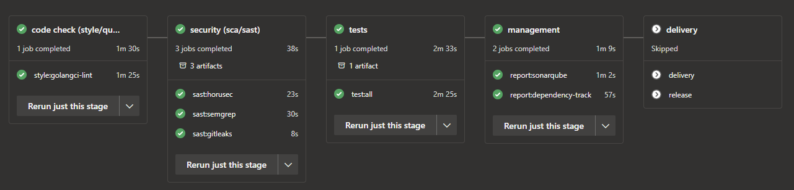

# CI/CD Pipeline Templates Repository

Welcome to the **Pipelines Project**! This repository provides comprehensive, enterprise-grade Software Development Life
Cycle (SDLC) pipeline templates for **GitHub Actions**, **GitLab CI**, and **Azure DevOps**. Our templates include
security scanning (SAST), dependency analysis (SCA), supply chain security (SSCA), testing, and deployment automation
for multiple programming languages.

## 🚀 Quick Start

Choose your platform and language:

- **[GitHub Actions](#github-actions)** - Modern, cloud-native CI/CD
- **[GitLab CI](#gitlab-ci)** - Integrated DevOps platform
- **[Azure DevOps](#azure-devops)** - Enterprise Microsoft ecosystem

## 📋 Table of Contents

- [Supported Platforms & Languages](#supported-platforms--languages)
- [Project Structure](#project-structure)
- [Platform Usage](#platform-usage)
- [Available Tools & Scripts](#available-tools--scripts)
- [Container Images](#container-images)
- [Development & Local Usage](#development--local-usage)
- [Troubleshooting](#troubleshooting)
- [Contributing](#contributing)

## 🛠 Supported Platforms & Languages

### Platforms

| Platform           | Status         | Documentation                  |
|--------------------|----------------|--------------------------------|
| **GitHub Actions** | ✅ Full Support | [Usage Guide](#github-actions) |
| **GitLab CI**      | ✅ Full Support | [Usage Guide](#gitlab-ci)      |
| **Azure DevOps**   | ✅ Full Support | [Usage Guide](#azure-devops)   |

### Programming Languages

| Language               | GitHub Actions | GitLab CI | Azure DevOps | Features                       |
|------------------------|----------------|-----------|--------------|--------------------------------|
| **GoLang**             | ✅              | ✅         | ✅            | Binary, Docker, ARM deployment |
| **Python**             | ✅              | ✅         | ✅            | PDM, Docker, K8s deployment    |
| **Java**               | ❌              | ✅         | ✅            | Maven, Gradle, Docker          |
| **JavaScript/Node.js** | ❌              | ✅         | ✅            | Yarn, Docker, K8s deployment   |
| **.NET/C#**            | ❌              | ✅         | ✅            | Framework, Core, Docker        |
| **Terraform**          | ❌              | ❌         | ✅            | Infrastructure as Code         |

## 📁 Project Structure

```
pipelines/
├── .github/workflows/          # GitHub Actions reusable workflows
│   ├── go-docker.yaml         # Go with Docker delivery
│   ├── go-binary.yaml         # Go binary compilation
│   ├── python-docker.yaml     # Python with Docker
│   └── ...
├── gitlab/                     # GitLab CI pipeline templates
│   ├── golang/                # Go language pipelines
│   ├── java/                  # Java language pipelines
│   ├── python/                # Python language pipelines
│   ├── javascript/            # JavaScript/Node.js pipelines
│   ├── dotnet/                # .NET language pipelines
│   └── global/                # Shared GitLab configurations
├── azure-devops/              # Azure DevOps pipeline templates
│   ├── golang/                # Go language pipelines
│   ├── java/                  # Java language pipelines
│   ├── python/                # Python language pipelines
│   ├── javascript/            # JavaScript/Node.js pipelines
│   ├── dotnet/                # .NET language pipelines
│   ├── terraform/             # Terraform pipelines
│   └── global/                # Shared Azure DevOps templates
├── global/                     # Shared resources across platforms
│   ├── scripts/               # Automation scripts
│   │   ├── golang/            # Go-specific scripts (test, cyclonedx)
│   │   ├── golangci-lint/     # Go linting configuration
│   │   ├── gitleaks/          # Secret scanning
│   │   ├── horusec/           # Security scanning
│   │   ├── semgrep/           # Static analysis
│   │   ├── sonarqube/         # Code quality
│   │   └── shared/            # Common utilities
│   ├── containers/            # Custom Docker images
│   │   ├── golang.*/          # Go development images
│   │   ├── python.*/          # Python development images
│   │   ├── awscli.latest/     # AWS CLI tools
│   │   └── tor-proxy.latest/  # Network proxy tools
│   └── configs/               # Configuration files
└── docs/                      # Documentation and examples
```

### Pipeline Architecture

Each platform follows a consistent **5-stage pipeline architecture**:

1. **🔍 Code Check (Style/Quality)** - Linting, formatting, code quality
2. **🔒 Security (SCA/SAST)** - Vulnerability scanning, secret detection
3. **🧪 Tests** - Unit tests, integration tests, coverage reporting
4. **📊 Management** - Dependency tracking, SBOM generation
5. **🚀 Delivery** - Build artifacts, container images, deployments

## 💻 Platform Usage

### GitHub Actions

GitHub Actions workflows are located in `.github/workflows/` and can be used as reusable workflows.

#### Available Workflows

| Workflow             | Purpose                           | Languages |
|----------------------|-----------------------------------|-----------|
| `go.yaml`            | Go testing and quality checks     | Go        |
| `go-docker.yaml`     | Go with Docker image delivery     | Go        |
| `go-binary.yaml`     | Go binary compilation and release | Go        |
| `python.yaml`        | Python testing and quality checks | Python    |
| `python-docker.yaml` | Python with Docker image delivery | Python    |

#### Usage Example (Go with Docker)

```yaml
name: 'CI/CD Pipeline'

on:
  push:
    branches: [ main ]
    tags: [ '*' ]
  pull_request:
    branches: [ main ]

permissions:
  checks: write      # Required for test results
  contents: write    # Required for releases
  packages: write    # Required for container registry

jobs:
  pipeline:
    uses: 'rios0rios0/pipelines/.github/workflows/go-docker.yaml@main'
```

#### Usage Example (Python with Docker)

```yaml
name: 'CI/CD Pipeline'

on:
  push:
    branches: [ main ]
  pull_request:
    branches: [ main ]

jobs:
  pipeline:
    uses: 'rios0rios0/pipelines/.github/workflows/python-docker.yaml@main'
```



### GitLab CI

GitLab CI templates use remote includes and are organized by language in the `gitlab/` directory.

#### Available Templates

| Language       | Template             | Purpose                    |
|----------------|----------------------|----------------------------|
| **Go**         | `go-docker.yaml`     | Go with Docker delivery    |
| **Go**         | `go-debian.yaml`     | Go Debian-based pipeline   |
| **Go**         | `go-sam.yaml`        | Go with AWS SAM deployment |
| **Java**       | `gradle-docker.yaml` | Gradle with Docker         |
| **Java**       | `maven-docker.yaml`  | Maven with Docker          |
| **Python**     | `pdm-docker.yaml`    | Python PDM with Docker     |
| **JavaScript** | `yarn-docker.yaml`   | Node.js Yarn with Docker   |
| **.NET**       | `framework.yaml`     | .NET Framework pipeline    |

#### Usage Example (Go with Docker)

```yaml
include:
  - remote: 'https://raw.githubusercontent.com/rios0rios0/pipelines/main/gitlab/golang/go-docker.yaml'

# Optional: Override delivery stage for custom Docker build
.delivery:
  script:
    - docker build -t "$REGISTRY_PATH$IMAGE_SUFFIX:$TAG" -f .ci/stages/40-delivery/Dockerfile .
  cache:
    key: 'test:all'
    paths: !reference [ .go, cache, paths ]
    policy: 'pull'
```

#### Usage Example (Python PDM)

```yaml
include:
  - remote: 'https://raw.githubusercontent.com/rios0rios0/pipelines/main/gitlab/python/pdm-docker.yaml'

variables:
  PYTHON_VERSION: "3.11"  # Optional: specify a Python version
```

#### Required GitLab Variables

Configure these in your GitLab project settings:

| Variable          | Description                    | Required For    |
|-------------------|--------------------------------|-----------------|
| `SONAR_HOST_URL`  | SonarQube server URL           | Code quality    |
| `SONAR_TOKEN`     | SonarQube authentication token | Code quality    |
| `DOCKER_REGISTRY` | Container registry URL         | Docker delivery |
| `DOCKER_USERNAME` | Registry username              | Docker delivery |
| `DOCKER_PASSWORD` | Registry password              | Docker delivery |



### Azure DevOps

Azure DevOps templates are located in the `azure-devops/` directory and use template references.

#### Available Templates

| Language       | Template               | Purpose                           |
|----------------|------------------------|-----------------------------------|
| **Go**         | `go-docker.yaml`       | Go with Docker delivery           |
| **Go**         | `go-arm.yaml`          | Go with Azure ARM deployment      |
| **Go**         | `go-function-arm.yaml` | Go Azure Functions                |
| **Go**         | `go-lambda.yaml`       | Go AWS Lambda deployment (ZIP)    |
| **Go**         | `go-lambda-sam.yaml`   | Go AWS Lambda deployment (SAM)    |
| **Java**       | `gradle-docker.yaml`   | Gradle with Docker                |
| **Java**       | `maven-docker.yaml`    | Maven with Docker                 |
| **Python**     | `pdm-docker.yaml`      | Python PDM with Docker            |
| **JavaScript** | `yarn-docker.yaml`     | Node.js Yarn with Docker          |
| **.NET**       | `framework.yaml`       | .NET Framework pipeline           |
| **Terraform**  | Various ARM templates  | Infrastructure as Code            |

#### Usage Example (Go with Docker)

```yaml
trigger:
  branches:
    include: [ main ]
  tags:
    include: [ '*' ]

pool:
  vmImage: 'ubuntu-latest'

variables:
  - ${{ if startsWith(variables['Build.SourceBranch'], 'refs/tags/') }}:
      - group: 'production-variables'
  - ${{ else }}:
      - group: 'development-variables'

resources:
  repositories:
    - repository: 'pipelines'
      type: 'github'
      name: 'rios0rios0/pipelines'
      endpoint: 'YOUR_GITHUB_SERVICE_CONNECTION'  # Configure this

stages:
  - template: 'azure-devops/golang/go-docker.yaml@pipelines'
```

#### Usage Example (Go with ARM Deployment)

```yaml
resources:
  repositories:
    - repository: 'pipelines'
      type: 'github'
      name: 'rios0rios0/pipelines'
      endpoint: 'YOUR_GITHUB_SERVICE_CONNECTION'

stages:
  - template: 'azure-devops/golang/go-arm.yaml@pipelines'
    parameters:
      DOCKER_BUILD_ARGS: '--build-arg VERSION=$(Build.BuildNumber)'
      RUN_BEFORE_BUILD: 'echo "Preparing build environment"'
```

#### Usage Example (Go with AWS Lambda)

```yaml
trigger:
  branches:
    include: [ main ]
  tags:
    include: [ '*' ]

pool:
  vmImage: 'ubuntu-latest'

variables:
  - ${{ if startsWith(variables['Build.SourceBranch'], 'refs/tags/') }}:
      - group: 'production-variables'
  - ${{ else }}:
      - group: 'development-variables'

resources:
  repositories:
    - repository: 'pipelines'
      type: 'github'
      name: 'rios0rios0/pipelines'
      endpoint: 'YOUR_GITHUB_SERVICE_CONNECTION'

stages:
  - template: 'azure-devops/golang/go-lambda.yaml@pipelines'
    parameters:
      LAMBDA_FUNCTION_NAME: 'my-go-lambda-function'
      AWS_REGION: 'us-east-1'
      AWS_SERVICE_CONNECTION: 'AWS-Service-Connection'  # Configure in Azure DevOps
      DEPLOY_STRATEGY: 'zip'  # or 'sam'
      GOARCH: 'amd64'  # or 'arm64'
      LAMBDA_TIMEOUT: '30'
      LAMBDA_MEMORY_SIZE: '128'
```

**For SAM-based deployments:**

```yaml
stages:
  - template: 'azure-devops/golang/go-lambda-sam.yaml@pipelines'
    parameters:
      S3_BUCKET: 'my-deployment-bucket'
      AWS_REGION: 'us-east-1'
      AWS_SERVICE_CONNECTION: 'AWS-Service-Connection'
      SAM_CONFIG_ENV: 'default'  # References samconfig.toml environment
```

#### Required Variable Groups

Create these variable groups in Azure DevOps Library:

**Shared Variables (All Projects):**
| Variable | Description |
|----------|-------------|
| `SONAR_HOST_URL` | SonarQube server URL |
| `SONAR_TOKEN` | SonarQube authentication token |

**Project-Specific Variables (.NET Example):**
| Variable | Description |
|----------|-------------|
| `SONAR_PROJECT_NAME` | SonarQube project display name |
| `SONAR_PROJECT_KEY` | SonarQube project unique key |

**AWS Lambda Deployment Variables (Optional):**
| Variable | Description | Required For |
|----------|-------------|--------------|
| `AWS_ACCESS_KEY_ID` | AWS access key (if not using service connection) | Lambda deployment |
| `AWS_SECRET_ACCESS_KEY` | AWS secret key (if not using service connection) | Lambda deployment |
| `LAMBDA_ROLE_ARN` | IAM role ARN for Lambda function | Creating new functions |

**Note:** For AWS deployments, it's recommended to use Azure DevOps AWS Service Connection instead of storing credentials in variable groups. Configure the service connection in Azure DevOps Project Settings → Service Connections.



## 🔧 Available Tools & Scripts

Our pipeline templates include a comprehensive suite of tools for security, quality, and testing:

### Security & Analysis Tools

| Tool                 | Purpose                 | Script Location                    | Configuration         |
|----------------------|-------------------------|------------------------------------|-----------------------|
| **Gitleaks**         | Secret detection        | `global/scripts/gitleaks/`         | `.gitleaks.toml`      |
| **Horusec**          | SAST security scanning  | `global/scripts/horusec/`          | `horusec*.json`       |
| **Semgrep**          | Static analysis         | `global/scripts/semgrep/`          | Auto-configured       |
| **SonarQube**        | Code quality & security | `global/scripts/sonarqube/`        | Project settings      |
| **Dependency Track** | SCA analysis            | `global/scripts/dependency-track/` | Environment variables |

### Language-Specific Tools

#### Go Tools

| Tool               | Purpose               | Script Location                    |
|--------------------|-----------------------|------------------------------------|
| **golangci-lint**  | Go linting suite      | `global/scripts/golangci-lint/`    |
| **Go Test Runner** | Comprehensive testing | `global/scripts/golang/test/`      |
| **CycloneDX**      | SBOM generation       | `global/scripts/golang/cyclonedx/` |

### Usage Examples

#### Run Security Scanning Locally

```bash
# Clone the pipelines repository
curl -sSL https://raw.githubusercontent.com/rios0rios0/pipelines/main/clone.sh | bash

# Set environment
export SCRIPTS_DIR=/home/$USER/Development/github.com/rios0rios0/pipelines

# Run secret detection
$SCRIPTS_DIR/global/scripts/gitleaks/run.sh

# Run static analysis
$SCRIPTS_DIR/global/scripts/semgrep/run.sh

# Run Go linting
$SCRIPTS_DIR/global/scripts/golangci-lint/run.sh
```

#### Configure Go Linting Globally

```bash
# Link global golangci-lint configuration
ln -s $SCRIPTS_DIR/global/scripts/golangci-lint/.golangci.yml ~/.golangci.yml

# Run with auto-fix
$SCRIPTS_DIR/global/scripts/golangci-lint/run.sh --fix
```

## 🐳 Container Images

We provide pre-built container images optimized for CI/CD environments:

### Available Images

| Image                      | Purpose                         | Registry                       |
|----------------------------|---------------------------------|--------------------------------|
| `golang.1.18-awscli`       | Go 1.18 + AWS CLI               | `ghcr.io/rios0rios0/pipelines` |
| `golang.1.19-awscli`       | Go 1.19 + AWS CLI               | `ghcr.io/rios0rios0/pipelines` |
| `python.3.9-pdm-buster`    | Python 3.9 + PDM                | `ghcr.io/rios0rios0/pipelines` |
| `python.3.10-pdm-bullseye` | Python 3.10 + PDM               | `ghcr.io/rios0rios0/pipelines` |
| `awscli.latest`            | AWS CLI tools                   | `ghcr.io/rios0rios0/pipelines` |
| `tor-proxy.latest`         | Network proxy with health check | `ghcr.io/rios0rios0/pipelines` |

### Building Custom Images

```bash
# Build and push a custom container
make build-and-push NAME=awscli TAG=latest

# Local build for testing
docker build -t my-image -f global/containers/awscli.latest/Dockerfile global/containers/awscli.latest/
```

## 💻 Development & Local Usage

### Installation & Setup

#### Quick Installation

```bash
# Download and set up the pipelines repository
curl -sSL https://raw.githubusercontent.com/rios0rios0/pipelines/main/clone.sh | bash
```

#### Manual Installation

```bash
# Clone to standard location
mkdir -p $HOME/Development/github.com/rios0rios0
cd $HOME/Development/github.com/rios0rios0
git clone https://github.com/rios0rios0/pipelines.git
```

### Local Development Workflow

#### Set Up Environment

```bash
# Export scripts directory for easy access
export SCRIPTS_DIR=/home/$USER/Development/github.com/rios0rios0/pipelines

# Add to your shell profile for persistence
echo 'export SCRIPTS_DIR=/home/$USER/Development/github.com/rios0rios0/pipelines' >> ~/.bashrc
```

#### Common Development Tasks

**Configure Go Development:**

```bash
# Link global Go linting configuration
ln -s $SCRIPTS_DIR/global/scripts/golangci-lint/.golangci.yml ~/.golangci.yml

# Run linting in your project
$SCRIPTS_DIR/global/scripts/golangci-lint/run.sh

# Run with auto-fix
$SCRIPTS_DIR/global/scripts/golangci-lint/run.sh --fix
```

**Run Tests and Security Scans:**

```bash
# Run comprehensive Go tests
$SCRIPTS_DIR/global/scripts/golang/test/run.sh

# Run security scans
$SCRIPTS_DIR/global/scripts/gitleaks/run.sh
$SCRIPTS_DIR/global/scripts/horusec/run.sh

# Run static analysis (note: can take 10+ minutes)
$SCRIPTS_DIR/global/scripts/semgrep/run.sh
```

### Testing Pipeline Changes

When developing pipeline modifications, you can test it against development branches:

#### Switch to Development Branch

```bash
export BRANCH=your-feature-branch-name

# Update all pipeline references to use your branch
find . -type f -name "*.yaml" -exec sed -i.bak -E "s|(remote: 'https://raw.githubusercontent.com/rios0rios0/pipelines/)[^/]+(/.*)|\\1$BRANCH\\2|g" {} +
```

#### Test Your Changes

```bash
# Update your project's pipeline reference
# Before:
include:
  - remote: 'https://raw.githubusercontent.com/rios0rios0/pipelines/main/gitlab/golang/go-docker.yaml'

# After:
include:
  - remote: 'https://raw.githubusercontent.com/rios0rios0/pipelines/your-feature-branch/gitlab/golang/go-docker.yaml'
```

### Validation & Testing

#### Run Repository Tests

```bash
# Run all validation tests
make test

# Run Go script validation specifically
make test-go-script

# Manual validation script
./test-go-validation.sh
```

#### Build Container Images

```bash
# Test container builds locally
make build-and-push NAME=awscli TAG=latest

# Build specific image for testing
docker build -t test-image -f global/containers/awscli.latest/Dockerfile global/containers/awscli.latest/
```

## 🐛 Troubleshooting

### Common Issues & Solutions

#### Pipeline Failures

**Issue: "No directories found to test it" (Go projects)**

- **Cause:** Go project structure doesn't match the expected layout
- **Solution:** Ensure your project has `cmd/`, `pkg/`, or `internal/` directories
- **Alternative:** Modify a test script to include your custom directories

**Issue: "golangci-lint: command not found"**

- **Cause:** golangci-lint not installed or not in PATH
- **Solution:** The script automatically downloads golangci-lint, ensure Docker is available

**Issue: Docker build fails with SSL certificate errors**

- **Cause:** Network restrictions in CI environment
- **Solution:** This is expected in restricted environments; contact your platform administrator

#### Security Tool Issues

**Issue: Horusec exits with code 101**

- **Cause:** No horusec configuration files found
- **Solution:** Create `horusec-config.json` in your project root or let the script use defaults

**Issue: Gitleaks takes too long or fails**

- **Cause:** Large repository or network issues
- **Solution:** Increase timeout values, ensure Docker daemon is accessible

**Issue: Semgrep timeout or hangs**

- **Cause:** Large codebase, downloading security rules
- **Solution:** Allow 10+ minutes for completion, don't cancel the operation

#### Platform-Specific Issues

**GitHub Actions:**

- **Issue:** Workflow doesn't trigger
- **Solution:** Check repository permissions, ensure workflow file is in `.github/workflows/`

**GitLab CI:**

- **Issue:** "Remote file could not be fetched"
- **Solution:** Verify the remote URL is accessible, check branch name in URL

**Azure DevOps:**

- **Issue:** "Template not found"
- **Solution:** Ensure GitHub service connection is configured correctly

### Environment Requirements

**Minimum Requirements:**

- Docker (for container builds and security tools)
- Git (for repository operations)
- Network access (for downloading tools and dependencies)

**Language-Specific Requirements:**

- **Go:** Go 1.18+ (automatically installed in CI)
- **Python:** Python 3.8+ (automatically managed in CI)
- **Java:** JDK 11+ (automatically managed in CI)
- **Node.js:** Node 16+ (automatically managed in CI)

### Performance Expectations

| Operation         | Expected Duration | Notes                                  |
|-------------------|-------------------|----------------------------------------|
| Script downloads  | 1-5 seconds       | First-time tool downloads              |
| Go linting        | 10-30 seconds     | Depends on codebase size               |
| Security scanning | 2-10 minutes      | Depends on tools and project size      |
| Container builds  | 5-30 minutes      | Depends on base image and dependencies |
| Semgrep analysis  | 5-15 minutes      | Downloads large rule sets              |

**Important:** Never cancel operations that appear to be hanging - they may be downloading large Docker images or rule
sets.

### Getting Help

1. **Check the logs:** Most scripts provide detailed output about what they're doing
2. **Verify environment:** Ensure Docker is running and network access is available
3. **Check examples:** Review the working examples in this README
4. **Review CONTRIBUTING.md:** For development and contribution guidelines
5. **Open an issue:** For bugs or feature requests on GitHub

## 📚 Additional Resources

- **[Contributing Guidelines](CONTRIBUTING.md)** - How to contribute to this project
- **[Changelog](CHANGELOG.md)** - Version history and changes
- **[License](LICENSE)** - MIT License details
- **Examples in `.docs/`** - Screenshots and detailed examples

## 🤝 Contributing

We welcome contributions! This project follows enterprise security and testing standards:

### Before Contributing

1. **Read [CONTRIBUTING.md](CONTRIBUTING.md)** for detailed guidelines
2. **Run tests:** Execute `make test` before submitting changes
3. **Test across platforms:** Validate changes on GitHub, GitLab, and Azure DevOps
4. **Update documentation:** Keep README and changelogs current

### Key Contribution Areas

- Adding support for new programming languages
- Improving security tool integration
- Enhancing container images
- Adding new platform features
- Improving documentation and examples

## 📄 License

This project is licensed under the MIT License. See the [LICENSE](LICENSE) file for details.

---

> **Note:** This repository provides **pipeline templates and automation scripts**, not a runnable application. Users
> consume these templates in their own projects to establish comprehensive CI/CD pipelines with security, quality, and
> testing automation.
