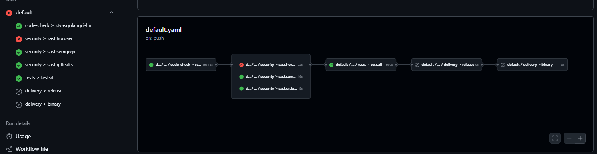
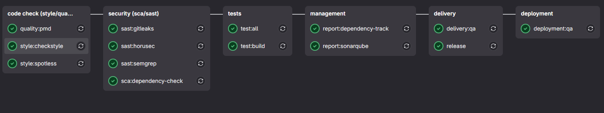
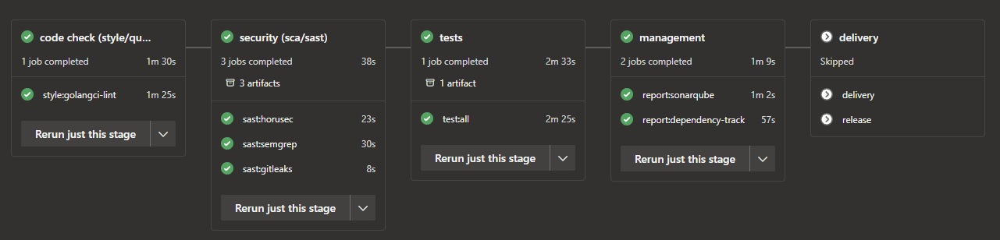

<h1 align="center">Pipelines</h1>
<p align="center">
    <a href="https://github.com/rios0rios0/pipelines/releases/latest">
        </a>
    <a href="https://github.com/rios0rios0/pipelines/blob/main/LICENSE">
        </a>
    <a href="https://github.com/rios0rios0/pipelines/actions/workflows/ci.yaml">
        </a>
    <a href="https://sonarcloud.io/summary/overall?id=rios0rios0_pipelines">
        </a>
    <a href="https://sonarcloud.io/summary/overall?id=rios0rios0_pipelines">
        </a>
    <a href="https://www.bestpractices.dev/projects/12028">
        </a>
</p>

Comprehensive, enterprise-grade SDLC pipeline templates for **GitHub Actions**, **GitLab CI**, and **Azure DevOps** with security scanning (SAST), dependency analysis (SCA), supply chain security (SSCA), testing, and deployment automation for multiple programming languages.

## Supported Platforms & Languages

### Platforms

| Platform           | Status       | Documentation                  |
|--------------------|--------------|--------------------------------|
| **GitHub Actions** | Full Support | [Usage Guide](#github-actions) |
| **GitLab CI**      | Full Support | [Usage Guide](#gitlab-ci)      |
| **Azure DevOps**   | Full Support | [Usage Guide](#azure-devops)   |

### Programming Languages

| Language               | GitHub Actions | GitLab CI | Azure DevOps | Features                       |
|------------------------|----------------|-----------|--------------|--------------------------------|
| **GoLang**             | yes            | yes       | yes          | Binary, Docker, ARM deployment |
| **Python**             | yes            | yes       | yes          | PDM, Docker, K8s deployment    |
| **Java**               | yes            | yes       | yes          | Maven, Gradle, Docker          |
| **JavaScript/Node.js** | yes            | yes       | yes          | npm, Yarn, Docker, K8s deployment |
| **PHP**                | yes            | no        | no           | Composer, Docker               |
| **Ruby**               | yes            | no        | no           | Bundler, Docker                |
| **.NET/C#**            | yes            | yes       | yes          | Framework, Core, Docker        |
| **Terraform**          | no             | yes       | yes          | Infrastructure as Code         |
| **Terra CLI**          | yes            | yes       | yes          | Terraform/Terragrunt wrapper   |

## Project Structure

```
pipelines/
├── .github/workflows/          # GitHub Actions reusable workflows
│   ├── go-docker.yaml         # Go with Docker delivery
│   ├── go-binary.yaml         # Go binary compilation
│   ├── python-docker.yaml     # Python with Docker
│   ├── java-docker.yaml       # Java/Gradle with Docker delivery
│   ├── java-maven-docker.yaml # Java/Maven with Docker delivery
│   ├── javascript-docker.yaml # JavaScript/Yarn with Docker delivery
│   ├── javascript-npm-docker.yaml # JavaScript/npm with Docker delivery
│   ├── php-docker.yaml        # PHP with Docker delivery
│   ├── ruby-docker.yaml       # Ruby with Docker delivery
│   ├── dotnet-docker.yaml     # .NET with Docker delivery
│   └── ...
├── gitlab/                     # GitLab CI pipeline templates
│   ├── golang/                # Go language pipelines
│   ├── java/                  # Java language pipelines
│   ├── python/                # Python language pipelines
│   ├── javascript/            # JavaScript/Node.js pipelines
│   ├── dotnet/                # .NET language pipelines
│   ├── terraform/             # Terraform pipelines (raw terraform/terragrunt)
│   ├── terra/                 # Terra CLI pipelines (terraform/terragrunt wrapper)
│   └── global/                # Shared GitLab configurations
├── azure-devops/              # Azure DevOps pipeline templates
│   ├── golang/                # Go language pipelines
│   ├── java/                  # Java language pipelines
│   ├── python/                # Python language pipelines
│   ├── javascript/            # JavaScript/Node.js pipelines
│   ├── dotnet/                # .NET language pipelines
│   ├── terraform/             # Terraform pipelines (raw terraform/terragrunt)
│   ├── terra/                 # Terra CLI pipelines (terraform/terragrunt wrapper)
│   └── global/                # Shared Azure DevOps templates
├── global/                     # Shared resources across platforms
│   ├── scripts/               # Automation scripts
│   │   ├── tools/             # Language-agnostic tools
│   │   │   ├── codeql/        # SAST security scanning (CodeQL)
│   │   │   ├── gitleaks/      # Secret scanning
│   │   │   ├── hadolint/      # Dockerfile linting
│   │   │   ├── semgrep/       # Static analysis
│   │   │   ├── sonarqube/     # Code quality
│   │   │   ├── trivy/         # IaC misconfiguration scanning
│   │   │   └── dependency-track/ # SCA analysis
│   │   ├── languages/         # Language-specific scripts
│   │   │   ├── golang/        # Go scripts (test, cyclonedx, golangci-lint, init)
│   │   │   └── python/        # Python scripts (cyclonedx)
│   │   └── shared/            # Common utilities
│   ├── containers/            # Custom Docker images
│   │   ├── golang.*/          # Go development images
│   │   ├── python.*/          # Python development images
│   │   ├── awscli.latest/     # AWS CLI tools
│   │   └── tor-proxy.latest/  # Network proxy tools
│   └── configs/               # Configuration files
├── makefiles/                  # Includable Makefile fragments for local usage
│   ├── common.mk              # Security tools (sast) and setup
│   ├── golang.mk              # Go targets (lint, test)
│   ├── python.mk              # Python/PDM targets (lint, test)
│   ├── java.mk                # Java/Gradle targets (lint, test)
│   ├── javascript.mk          # JavaScript/Yarn targets (lint, test)
│   ├── dotnet.mk              # .NET/C# targets (lint, test)
│   ├── terraform.mk           # Terraform targets (lint, test)
│   └── terra.mk               # Terra CLI targets (lint, test)
├── .docs/                      # Documentation and examples
│   └── examples/              # Per-provider usage examples
└── .github/tests/              # Validation scripts for this repository
```

### Pipeline Architecture

Each platform follows a consistent **5-stage pipeline architecture**:

1. **Code Check (Style/Quality)** - Linting, formatting, code quality, rebase verification
2. **Security (SCA/SAST)** - Vulnerability scanning, secret detection
3. **Tests** - Unit tests, integration tests, coverage reporting
4. **Management** - Dependency tracking, SBOM generation
5. **Delivery** - Build artifacts, container images, deployments

## Installation

### Quick Installation

```bash
curl -sSL https://raw.githubusercontent.com/rios0rios0/pipelines/main/clone.sh | bash
```

You can override the installation location with the `PIPELINES_HOME` environment variable:

```bash
PIPELINES_HOME=/opt/pipelines curl -sSL https://raw.githubusercontent.com/rios0rios0/pipelines/main/clone.sh | bash
```

### Manual Installation

```bash
mkdir -p $HOME/Development/github.com/rios0rios0
cd $HOME/Development/github.com/rios0rios0
git clone https://github.com/rios0rios0/pipelines.git
```

## Platform Usage

### GitHub Actions

GitHub Actions workflows are located in `.github/workflows/` and can be used as reusable workflows.

#### Available Workflows

| Workflow                  | Purpose                                    | Languages      |
|---------------------------|--------------------------------------------|----------------|
| `go.yaml`                 | Go testing and quality checks              | Go             |
| `go-docker.yaml`          | Go with Docker image delivery              | Go             |
| `go-binary.yaml`          | Go binary compilation and release          | Go             |
| `python.yaml`             | Python testing and quality checks          | Python         |
| `python-docker.yaml`      | Python with Docker image delivery          | Python         |
| `java.yaml`               | Java/Gradle testing and quality checks     | Java           |
| `java-docker.yaml`        | Java/Gradle with Docker image delivery     | Java           |
| `javascript.yaml`         | JavaScript/Yarn testing and quality checks | JavaScript     |
| `javascript-docker.yaml`  | JavaScript/Yarn with Docker image delivery | JavaScript     |
| `dotnet.yaml`             | .NET testing and quality checks            | C#             |
| `dotnet-docker.yaml`      | .NET with Docker image delivery            | C#             |
| `javascript-npm.yaml`     | JavaScript/npm testing and quality checks  | JavaScript     |
| `javascript-npm-docker.yaml` | JavaScript/npm with Docker image delivery | JavaScript     |
| `java-maven.yaml`        | Java/Maven testing and quality checks      | Java           |
| `java-maven-docker.yaml` | Java/Maven with Docker image delivery      | Java           |
| `php.yaml`               | PHP/Composer testing and quality checks    | PHP            |
| `php-docker.yaml`        | PHP/Composer with Docker image delivery    | PHP            |
| `ruby.yaml`              | Ruby/Bundler testing and quality checks    | Ruby           |
| `ruby-docker.yaml`       | Ruby/Bundler with Docker image delivery    | Ruby           |
| `terra.yaml`              | Terra CLI quality, security, and tests     | Terraform/HCL  |

#### Usage Example (Go with Docker)

```yaml
name: 'CI/CD Pipeline'

on:
  push:
    branches: [ main ]
    tags: [ '*' ]
  pull_request:
    branches: [ main ]

permissions:
  checks: write      # Required for test results
  contents: write    # Required for releases
  packages: write    # Required for container registry

jobs:
  pipeline:
    uses: 'rios0rios0/pipelines/.github/workflows/go-docker.yaml@main'
```

#### Usage Example (Python with Docker)

```yaml
name: 'CI/CD Pipeline'

on:
  push:
    branches: [ main ]
  pull_request:
    branches: [ main ]

jobs:
  pipeline:
    uses: 'rios0rios0/pipelines/.github/workflows/python-docker.yaml@main'
```

#### Usage Example (Java with Docker)

```yaml
name: 'CI/CD Pipeline'

on:
  push:
    branches: [ main ]
    tags: [ '*' ]
  pull_request:
    branches: [ main ]

permissions:
  security-events: write
  contents: write
  packages: write

jobs:
  pipeline:
    uses: 'rios0rios0/pipelines/.github/workflows/java-docker.yaml@main'
```

#### Usage Example (JavaScript with Docker)

```yaml
name: 'CI/CD Pipeline'

on:
  push:
    branches: [ main ]
    tags: [ '*' ]
  pull_request:
    branches: [ main ]

permissions:
  security-events: write
  contents: write
  packages: write

jobs:
  pipeline:
    uses: 'rios0rios0/pipelines/.github/workflows/javascript-docker.yaml@main'
```

#### Usage Example (.NET with Docker)

```yaml
name: 'CI/CD Pipeline'

on:
  push:
    branches: [ main ]
    tags: [ '*' ]
  pull_request:
    branches: [ main ]

permissions:
  security-events: write
  contents: write
  packages: write

jobs:
  pipeline:
    uses: 'rios0rios0/pipelines/.github/workflows/dotnet-docker.yaml@main'
```

#### Usage Example (JavaScript/npm with Docker)

```yaml
name: 'CI/CD Pipeline'

on:
  push:
    branches: [ main ]
    tags: [ '*' ]
  pull_request:
    branches: [ main ]

permissions:
  security-events: write
  contents: write
  packages: write

jobs:
  pipeline:
    uses: 'rios0rios0/pipelines/.github/workflows/javascript-npm-docker.yaml@main'
```

#### Usage Example (Java/Maven with Docker)

```yaml
name: 'CI/CD Pipeline'

on:
  push:
    branches: [ main ]
    tags: [ '*' ]
  pull_request:
    branches: [ main ]

permissions:
  security-events: write
  contents: write
  packages: write

jobs:
  pipeline:
    uses: 'rios0rios0/pipelines/.github/workflows/java-maven-docker.yaml@main'
```

#### Usage Example (PHP with Docker)

```yaml
name: 'CI/CD Pipeline'

on:
  push:
    branches: [ main ]
    tags: [ '*' ]
  pull_request:
    branches: [ main ]

permissions:
  contents: write
  packages: write

jobs:
  pipeline:
    uses: 'rios0rios0/pipelines/.github/workflows/php-docker.yaml@main'
```

#### Usage Example (Ruby with Docker)

```yaml
name: 'CI/CD Pipeline'

on:
  push:
    branches: [ main ]
    tags: [ '*' ]
  pull_request:
    branches: [ main ]

permissions:
  security-events: write
  contents: write
  packages: write

jobs:
  pipeline:
    uses: 'rios0rios0/pipelines/.github/workflows/ruby-docker.yaml@main'
```



### GitLab CI

GitLab CI templates use remote includes and are organized by language in the `gitlab/` directory.

#### Available Templates

| Language        | Template             | Purpose                    |
|-----------------|----------------------|----------------------------|
| **Go**          | `go-docker.yaml`     | Go with Docker delivery    |
| **Go**          | `go-binary.yaml`     | Go binary pipeline         |
| **Go**          | `go-sam.yaml`        | Go with AWS SAM deployment |
| **Java**        | `gradle-docker.yaml` | Gradle with Docker         |
| **Java**        | `maven-docker.yaml`  | Maven with Docker          |
| **Python**      | `pdm-docker.yaml`    | Python PDM with Docker     |
| **JavaScript**  | `yarn-docker.yaml`   | Node.js Yarn with Docker   |
| **.NET**        | `framework.yaml`     | .NET Framework pipeline    |
| **Terraform**   | `terra.yaml`         | Terraform IaC pipeline     |

#### Usage Example (Go with Docker)

```yaml
include:
  - remote: 'https://raw.githubusercontent.com/rios0rios0/pipelines/main/gitlab/golang/go-docker.yaml'

# Optional: Override delivery stage for custom Docker build
.delivery:
  script:
    - docker build -t "$REGISTRY_PATH$IMAGE_SUFFIX:$TAG" -f .ci/stages/40-delivery/Dockerfile .
  cache:
    key: 'test:all'
    paths: !reference [ .go, cache, paths ]
    policy: 'pull'
```

#### Usage Example (Python PDM)

```yaml
include:
  - remote: 'https://raw.githubusercontent.com/rios0rios0/pipelines/main/gitlab/python/pdm-docker.yaml'

variables:
  PYTHON_VERSION: "3.11"  # Optional: specify a Python version
```

#### Usage Example (Terraform -- raw terraform/terragrunt)

```yaml
include:
  - remote: 'https://raw.githubusercontent.com/rios0rios0/pipelines/main/gitlab/terraform/terra.yaml'
```

#### Usage Example (Terra CLI)

The [terra CLI](https://github.com/rios0rios0/terra) wraps Terraform and Terragrunt with a simplified interface, auto-answering prompts, and parallel execution. The terra pipeline provides code check, security, tests, and management stages. Delivery is intentionally excluded because it is project-specific (plan/apply targets, environments, stack ordering). See examples for all providers in the Azure DevOps section below.

#### Required GitLab Variables

Configure these in your GitLab project settings:

| Variable          | Description                    | Required For    |
|-------------------|--------------------------------|-----------------|
| `SONAR_HOST_URL`  | SonarQube server URL           | Code quality    |
| `SONAR_TOKEN`     | SonarQube authentication token | Code quality    |
| `DOCKER_REGISTRY` | Container registry URL         | Docker delivery |
| `DOCKER_USERNAME` | Registry username              | Docker delivery |
| `DOCKER_PASSWORD` | Registry password              | Docker delivery |



### Azure DevOps

Azure DevOps templates are located in the `azure-devops/` directory and use template references.

#### Available Templates

| Language        | Template               | Purpose                           |
|-----------------|------------------------|-----------------------------------|
| **Go**          | `go-docker.yaml`       | Go with Docker delivery           |
| **Go**          | `go-arm.yaml`          | Go with Azure ARM deployment      |
| **Go**          | `go-function-arm.yaml` | Go Azure Functions                |
| **Go**          | `go-lambda.yaml`       | Go AWS Lambda deployment (ZIP)    |
| **Go**          | `go-lambda-sam.yaml`   | Go AWS Lambda deployment (SAM)    |
| **Java**        | `kotlin-gradle.yaml`   | Kotlin/Gradle with Docker         |
| **Python**      | `pdm-docker.yaml`      | Python PDM with Docker            |
| **JavaScript**  | `yarn-docker.yaml`     | Node.js Yarn with Docker          |
| **.NET**        | `core.yaml`            | .NET Core pipeline                |
| **Terraform**   | `terra.yaml`           | Infrastructure as Code pipeline   |
| **Terra CLI**   | `terra/terra.yaml`     | Terra CLI wrapper pipeline        |

#### Usage Example (Go with Docker)

```yaml
trigger:
  branches:
    include: [ main ]
  tags:
    include: [ '*' ]

pool:
  vmImage: 'ubuntu-latest'

variables:
  - ${{ if startsWith(variables['Build.SourceBranch'], 'refs/tags/') }}:
      - group: 'production-variables'
  - ${{ else }}:
      - group: 'development-variables'

resources:
  repositories:
    - repository: 'pipelines'
      type: 'github'
      name: 'rios0rios0/pipelines'
      endpoint: 'YOUR_GITHUB_SERVICE_CONNECTION'  # Configure this

stages:
  - template: 'azure-devops/golang/go-docker.yaml@pipelines'
```

#### Usage Example (Go with ARM Deployment)

```yaml
resources:
  repositories:
    - repository: 'pipelines'
      type: 'github'
      name: 'rios0rios0/pipelines'
      endpoint: 'YOUR_GITHUB_SERVICE_CONNECTION'

stages:
  - template: 'azure-devops/golang/go-arm.yaml@pipelines'
    parameters:
      DOCKER_BUILD_ARGS: '--build-arg VERSION=$(Build.BuildNumber)'
      RUN_BEFORE_BUILD: 'echo "Preparing build environment"'
```

#### Usage Example (Go with AWS Lambda)

```yaml
trigger:
  branches:
    include: [ main ]
  tags:
    include: [ '*' ]

pool:
  vmImage: 'ubuntu-latest'

variables:
  - ${{ if startsWith(variables['Build.SourceBranch'], 'refs/tags/') }}:
      - group: 'production-variables'
  - ${{ else }}:
      - group: 'development-variables'

resources:
  repositories:
    - repository: 'pipelines'
      type: 'github'
      name: 'rios0rios0/pipelines'
      endpoint: 'YOUR_GITHUB_SERVICE_CONNECTION'

stages:
  - template: 'azure-devops/golang/go-lambda.yaml@pipelines'
    parameters:
      LAMBDA_FUNCTION_NAME: 'my-go-lambda-function'
      AWS_REGION: 'us-east-1'
      AWS_SERVICE_CONNECTION: 'AWS-Service-Connection'  # Configure in Azure DevOps
      DEPLOY_STRATEGY: 'zip'  # or 'sam'
      GOARCH: 'amd64'  # or 'arm64'
      LAMBDA_TIMEOUT: '30'
      LAMBDA_MEMORY_SIZE: '128'
```

**For SAM-based deployments:**

```yaml
stages:
  - template: 'azure-devops/golang/go-lambda-sam.yaml@pipelines'
    parameters:
      S3_BUCKET: 'my-deployment-bucket'
      AWS_REGION: 'us-east-1'
      AWS_SERVICE_CONNECTION: 'AWS-Service-Connection'
      SAM_CONFIG_ENV: 'default'  # References samconfig.toml environment
```

#### Required Variable Groups

Create these variable groups in Azure DevOps Library:

**Shared Variables (All Projects):**

| Variable | Description |
|----------|-------------|
| `SONAR_HOST_URL` | SonarQube server URL |
| `SONAR_TOKEN` | SonarQube authentication token |

**Project-Specific Variables (.NET Example):**

| Variable | Description |
|----------|-------------|
| `SONAR_PROJECT_NAME` | SonarQube project display name |
| `SONAR_PROJECT_KEY` | SonarQube project unique key |

**AWS Lambda Deployment Variables (Optional):**

| Variable | Description | Required For |
|----------|-------------|--------------|
| `AWS_ACCESS_KEY_ID` | AWS access key (if not using service connection) | Lambda deployment |
| `AWS_SECRET_ACCESS_KEY` | AWS secret key (if not using service connection) | Lambda deployment |
| `LAMBDA_ROLE_ARN` | IAM role ARN for Lambda function | Creating new functions |

**Note:** For AWS deployments, it is recommended to use Azure DevOps AWS Service Connection instead of storing credentials in variable groups. Configure the service connection in Azure DevOps Project Settings > Service Connections.



## Available Tools & Scripts

### Security & Analysis Tools

#### SAST (Static Application Security Testing)

| Tool                 | Purpose                       | Script Location                          | Configuration         |
|----------------------|-------------------------------|------------------------------------------|-----------------------|
| **Gitleaks**         | Secret detection              | `global/scripts/tools/gitleaks/`         | `.gitleaks.toml`      |
| **CodeQL**           | SAST security scanning        | `global/scripts/tools/codeql/`           | Auto-configured       |
| **Semgrep**          | Static analysis               | `global/scripts/tools/semgrep/`          | Auto-configured       |
| **Hadolint**         | Dockerfile linting            | `global/scripts/tools/hadolint/`         | `.hadolint.yaml`      |
| **Trivy IaC**        | IaC misconfiguration scanning | `global/scripts/tools/trivy/run.sh`      | `.trivyignore`        |

#### SCA (Software Composition Analysis)

| Tool                       | Purpose                           | Languages  | Script / Integration                           |
|----------------------------|-----------------------------------|------------|------------------------------------------------|
| **Trivy SCA**              | Dependency vulnerability scanning | All        | `global/scripts/tools/trivy/run-sca.sh`        |
| **govulncheck**            | Go vulnerability scanning         | Go         | `global/scripts/languages/golang/govulncheck/` |
| **Safety**                 | Python dependency scanning        | Python     | `pdm run safety-scan`                         |
| **OWASP Dependency-Check** | Java dependency scanning          | Java       | `./gradlew dependencyCheckAnalyze`             |
| **yarn npm audit**         | JS/Node.js dependency scanning    | JavaScript | `yarn npm audit --recursive`                   |
| **npm audit**              | JS/Node.js dependency scanning    | JavaScript | `npm audit --audit-level=high`                 |
| **Composer Audit**         | PHP dependency scanning           | PHP        | `composer audit`                               |
| **bundler-audit**          | Ruby dependency scanning          | Ruby       | `bundle-audit check --update`                  |

#### Quality & Management

| Tool                 | Purpose                       | Script Location                          | Configuration         |
|----------------------|-------------------------------|------------------------------------------|-----------------------|
| **Rebase Check**     | PR/MR rebase verification     | `global/scripts/shared/rebase-check.sh`  | Auto-configured       |
| **SonarQube**        | Code quality & security       | `global/scripts/tools/sonarqube/`        | Project settings      |
| **Dependency Track** | SBOM tracking                 | `global/scripts/tools/dependency-track/` | Environment variables |

### Rebase Check

Every pipeline includes a **rebase check** that runs in parallel with linting during the **Code Check** stage. This job verifies that the PR/MR branch is rebased on top of the target branch (usually `main`). If the branch is behind, the pipeline fails with clear instructions to rebase.

This enforces a linear commit history and prevents merge conflicts from reaching the test and delivery stages.

### Language-Specific Tools

#### Go Tools

| Tool               | Purpose               | Script Location                                  |
|--------------------|-----------------------|--------------------------------------------------|
| **golangci-lint**  | Go linting suite      | `global/scripts/languages/golang/golangci-lint/` |
| **Go Test Runner** | Comprehensive testing | `global/scripts/languages/golang/test/`          |
| **CycloneDX**      | SBOM generation       | `global/scripts/languages/golang/cyclonedx/`     |

### Usage Examples

#### Run Security Scanning Locally (via Makefile)

```bash
make setup      # Clone/update pipelines repo
make lint       # Run golangci-lint
make test       # Run Go tests with coverage
make security   # Run all security tools (CodeQL, Gitleaks, Hadolint, Trivy, Semgrep)
```

#### Configure Go Linting Globally

```bash
# Symlink the shared golangci-lint config for IDE integration
SCRIPTS_DIR=$HOME/Development/github.com/rios0rios0/pipelines
ln -s $SCRIPTS_DIR/global/scripts/languages/golang/golangci-lint/.golangci.yml ~/.golangci.yml
```

## Container Images

Pre-built container images optimized for CI/CD environments:

| Image                      | Purpose                         | Registry                       |
|----------------------------|---------------------------------|--------------------------------|
| `golang.1.18-awscli`       | Go 1.18 + AWS CLI               | `ghcr.io/rios0rios0/pipelines` |
| `golang.1.19-awscli`       | Go 1.19 + AWS CLI               | `ghcr.io/rios0rios0/pipelines` |
| `python.3.9-pdm-buster`    | Python 3.9 + PDM                | `ghcr.io/rios0rios0/pipelines` |
| `python.3.10-pdm-bullseye` | Python 3.10 + PDM               | `ghcr.io/rios0rios0/pipelines` |
| `awscli.latest`            | AWS CLI tools                   | `ghcr.io/rios0rios0/pipelines` |
| `tor-proxy.latest`         | Network proxy with health check | `ghcr.io/rios0rios0/pipelines` |

### Building Custom Images

```bash
# Build and push a custom container
make build-and-push NAME=awscli TAG=latest

# Local build for testing
docker build -t my-image -f global/containers/awscli.latest/Dockerfile global/containers/awscli.latest/
```

## Makefile Integration

The recommended way to use this repository locally is through the includable `.mk` files. GNU Make's `-include` directive imports targets from the pipelines repository, so your project Makefile only needs to declare `SCRIPTS_DIR` and the includes:

**Before** (repeated in every project):

```makefile
SCRIPTS_DIR = $(HOME)/Development/github.com/rios0rios0/pipelines

.PHONY: lint
lint:
	${SCRIPTS_DIR}/global/scripts/languages/golang/golangci-lint/run.sh --fix .

.PHONY: test
test:
	${SCRIPTS_DIR}/global/scripts/languages/golang/test/run.sh .

.PHONY: sast
sast:
	${SCRIPTS_DIR}/global/scripts/tools/codeql/run.sh "go"
```

**After** (include once, get all targets):

```makefile
# Pipeline targets: setup, sast, lint, test
SCRIPTS_DIR ?= $(HOME)/Development/github.com/rios0rios0/pipelines
-include $(SCRIPTS_DIR)/makefiles/common.mk
-include $(SCRIPTS_DIR)/makefiles/golang.mk

build:
	go build -o bin/app .

run:
	go run .
```

This gives you the following targets for free:

| Target       | Source            | Description                              |
|--------------|-------------------|------------------------------------------|
| `make setup` | `common.mk`       | Clone or update the pipelines repository |
| `make sast`  | `common.mk`       | Run all security SAST tools              |
| `make lint`  | `<language>.mk`   | Run language-specific linter             |
| `make test`  | `<language>.mk`   | Run language-specific tests              |

Available language files:

| File            | Language          | `lint`                                | `test`                          |
|-----------------|-------------------|---------------------------------------|---------------------------------|
| `golang.mk`     | Go                | `golangci-lint --fix`                 | Go test + coverage              |
| `python.mk`     | Python (PDM)      | `isort` + `black` + `flake8` + `mypy` | `pytest`                        |
| `java.mk`       | Java (Gradle)     | `./gradlew check`                     | `./gradlew test`                |
| `javascript.mk` | JavaScript (Yarn) | `yarn lint`                           | `yarn test`                     |
| `dotnet.mk`     | .NET/C#           | `dotnet format`                       | `dotnet test`                   |
| `terraform.mk`  | Terraform         | `terraform fmt` + `validate`          | `terraform plan`                |
| `terra.mk`      | Terra CLI         | `terra format` + git diff check       | `terraform test` on all modules |

The `-include` prefix means Make silently skips the includes if the repository is not cloned yet. Run `make setup` (or `curl ... | bash`) to bootstrap.

See the [`.docs/examples/`](.docs/examples) directory for complete per-provider examples including Makefiles.

### Direct Script Usage

If you prefer calling scripts directly without Makefile includes:

```bash
export SCRIPTS_DIR=$HOME/Development/github.com/rios0rios0/pipelines

# Go linting
$SCRIPTS_DIR/global/scripts/languages/golang/golangci-lint/run.sh --fix

# Go tests
$SCRIPTS_DIR/global/scripts/languages/golang/test/run.sh

# Security scans
$SCRIPTS_DIR/global/scripts/tools/gitleaks/run.sh
$SCRIPTS_DIR/global/scripts/tools/codeql/run.sh go
$SCRIPTS_DIR/global/scripts/tools/hadolint/run.sh
$SCRIPTS_DIR/global/scripts/tools/trivy/run.sh
$SCRIPTS_DIR/global/scripts/tools/semgrep/run.sh
```

### Testing Pipeline Changes

When developing pipeline modifications, you can test against development branches:

#### Switch to Development Branch

```bash
export BRANCH=your-feature-branch-name

# Update all pipeline references to use your branch
find . -type f -name "*.yaml" -exec sed -i.bak -E "s|(remote: 'https://raw.githubusercontent.com/rios0rios0/pipelines/)[^/]+(/.*)|\\1$BRANCH\\2|g" {} +
```

#### Test Your Changes

```bash
# Update your project's pipeline reference
# Before:
include:
  - remote: 'https://raw.githubusercontent.com/rios0rios0/pipelines/main/gitlab/golang/go-docker.yaml'

# After:
include:
  - remote: 'https://raw.githubusercontent.com/rios0rios0/pipelines/your-feature-branch/gitlab/golang/go-docker.yaml'
```

## Troubleshooting

### Common Issues & Solutions

#### Pipeline Failures

**Issue: "No directories found to test it" (Go projects)**

- **Cause:** Go project structure does not match the expected layout
- **Solution:** Ensure your project has `cmd/`, `pkg/`, or `internal/` directories
- **Alternative:** Modify the test script to include your custom directories

**Issue: "golangci-lint: command not found"**

- **Cause:** golangci-lint not installed or not in PATH
- **Solution:** The script automatically downloads golangci-lint, ensure Docker is available

**Issue: Docker build fails with SSL certificate errors**

- **Cause:** Network restrictions in CI environment
- **Solution:** This is expected in restricted environments; contact your platform administrator

#### Security Tool Issues

**Issue: CodeQL analysis fails**

- **Cause:** CodeQL CLI not installed or language not supported
- **Solution:** Ensure network access to download CodeQL CLI bundle; supported languages: go, python, java, javascript, csharp, ruby (PHP is not supported)

**Issue: Gitleaks takes too long or fails**

- **Cause:** Large repository or network issues
- **Solution:** Increase timeout values, ensure Docker daemon is accessible

**Issue: Semgrep timeout or hangs**

- **Cause:** Large codebase, downloading security rules
- **Solution:** Allow 10+ minutes for completion, do not cancel the operation

**Issue: Hadolint skips analysis**

- **Cause:** No Dockerfiles found in the project
- **Solution:** This is expected for projects without Dockerfiles; Hadolint auto-skips gracefully

**Issue: Trivy IaC scan finds false positives**

- **Cause:** Trivy flags misconfigurations in Terraform, Kubernetes, or Dockerfiles
- **Solution:** Add entries to `.trivyignore` in the project root to suppress known false positives

#### Platform-Specific Issues

**GitHub Actions:**

- **Issue:** Workflow does not trigger
- **Solution:** Check repository permissions, ensure workflow file is in `.github/workflows/`

**GitLab CI:**

- **Issue:** "Remote file could not be fetched"
- **Solution:** Verify the remote URL is accessible, check branch name in URL

**Azure DevOps:**

- **Issue:** "Template not found"
- **Solution:** Ensure GitHub service connection is configured correctly

### Environment Requirements

**Minimum Requirements:**

- Docker (for container builds and security tools)
- Git (for repository operations)
- Network access (for downloading tools and dependencies)

**Language-Specific Requirements:**

- **Go:** Go 1.18+ (automatically installed in CI)
- **Python:** Python 3.8+ (automatically managed in CI)
- **Java:** JDK 11+ (automatically managed in CI)
- **Node.js:** Node 16+ (automatically managed in CI)

### Performance Expectations

| Operation         | Expected Duration | Notes                                  |
|-------------------|-------------------|----------------------------------------|
| Script downloads  | 1-5 seconds       | First-time tool downloads              |
| Go linting        | 10-30 seconds     | Depends on codebase size               |
| Security scanning | 2-10 minutes      | Depends on tools and project size      |
| Container builds  | 5-30 minutes      | Depends on base image and dependencies |
| Semgrep analysis  | 5-15 minutes      | Downloads large rule sets              |

**Important:** Never cancel operations that appear to be hanging - they may be downloading large Docker images or rule sets.

## Contributing

Contributions are welcome. See [CONTRIBUTING.md](CONTRIBUTING.md) for guidelines.

## License

This project is licensed under the [MIT](LICENSE) License.

---

> **Note:** This repository provides **pipeline templates and automation scripts**, not a runnable application. Users consume these templates in their own projects to establish comprehensive CI/CD pipelines with security, quality, and testing automation.
