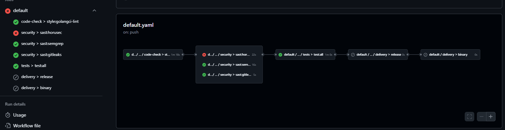
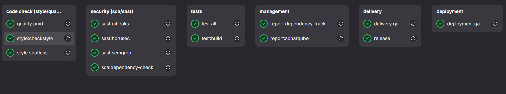
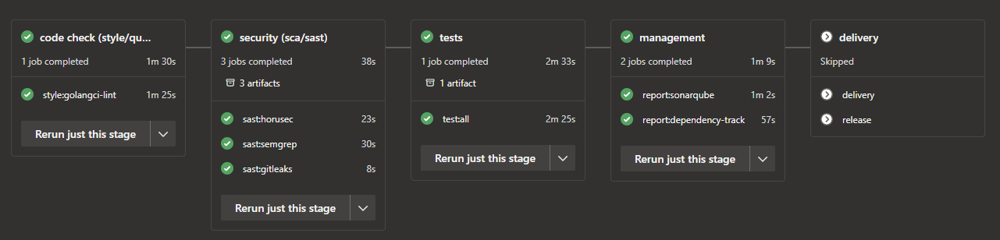

<h1 align="center">Pipelines</h1>
<p align="center">
    <a href="https://github.com/rios0rios0/pipelines/releases/latest">
        </a>
    <a href="https://github.com/rios0rios0/pipelines/blob/main/LICENSE">
        </a>
    <a href="https://github.com/rios0rios0/pipelines/actions/workflows/ci.yaml">
        </a>
    <a href="https://sonarcloud.io/summary/overall?id=rios0rios0_pipelines">
        </a>
    <a href="https://sonarcloud.io/summary/overall?id=rios0rios0_pipelines">
        </a>
    <a href="https://www.bestpractices.dev/projects/12028">
        </a>
</p>

Comprehensive, enterprise-grade SDLC pipeline templates for **GitHub Actions**, **GitLab CI**, and **Azure DevOps** with security scanning (SAST), dependency analysis (SCA), supply chain security (SSCA), testing, and deployment automation for multiple programming languages.

## Supported Platforms & Languages

### Platforms

| Platform           | Status       | Documentation                  |
|--------------------|--------------|--------------------------------|
| **GitHub Actions** | Full Support | [Usage Guide](#github-actions) |
| **GitLab CI**      | Full Support | [Usage Guide](#gitlab-ci)      |
| **Azure DevOps**   | Full Support | [Usage Guide](#azure-devops)   |

### Programming Languages

| Language               | GitHub Actions | GitLab CI | Azure DevOps | Features                          |
|------------------------|----------------|-----------|--------------|-----------------------------------|
| **GoLang**             | yes            | yes       | yes          | Binary, Docker, ARM deployment    |
| **Python**             | yes            | yes       | yes          | PDM, Docker, K8s deployment       |
| **Java**               | yes            | yes       | yes          | Maven, Gradle, Docker             |
| **JavaScript/Node.js** | yes            | yes       | yes          | npm, Yarn, Docker, K8s deployment |
| **PHP**                | yes            | no        | no           | Composer, Docker                  |
| **Ruby**               | yes            | no        | no           | Bundler, Docker                   |
| **.NET/C#**            | yes            | yes       | yes          | Framework, Core, Docker           |
| **Dart**               | yes            | yes       | yes          | pub.dev, Docker, native binary    |
| **Flutter**            | yes            | yes       | yes          | Web, Android APK/AAB, Docker      |
| **Terraform**          | no             | yes       | yes          | Infrastructure as Code            |
| **Terra CLI**          | yes            | yes       | yes          | Terraform/Terragrunt wrapper      |

## Project Structure

```
pipelines/
├── .github/workflows/          # GitHub Actions reusable workflows
│   ├── go-docker.yaml         # Go with Docker delivery
│   ├── go-render.yaml         # Go with Docker delivery + Render deployment
│   ├── go-binary.yaml         # Go binary compilation
│   ├── pdm-docker.yaml        # Python/PDM with Docker
│   ├── gradle-docker.yaml     # Java/Gradle with Docker delivery
│   ├── maven-docker.yaml      # Java/Maven with Docker delivery
│   ├── yarn-docker.yaml       # JavaScript/Yarn with Docker delivery
│   ├── npm-docker.yaml        # JavaScript/npm with Docker delivery
│   ├── composer-docker.yaml   # PHP/Composer with Docker delivery
│   ├── bundler-docker.yaml    # Ruby/Bundler with Docker delivery
│   ├── dotnet-docker.yaml     # .NET with Docker delivery
│   ├── dart-docker.yaml       # Dart with Docker delivery
│   ├── dart-library.yaml      # Dart package published to pub.dev
│   ├── flutter-artifacts.yaml # Flutter web bundle + Android APK/AAB
│   └── ...
├── gitlab/                     # GitLab CI pipeline templates
│   ├── golang/                # Go language pipelines
│   ├── java/                  # Java language pipelines
│   ├── python/                # Python language pipelines
│   ├── javascript/            # JavaScript/Node.js pipelines
│   ├── dotnet/                # .NET language pipelines
│   ├── dart/                  # Dart and Flutter pipelines
│   ├── terraform/             # Terraform pipelines (raw terraform/terragrunt)
│   ├── terra/                 # Terra CLI pipelines (terraform/terragrunt wrapper)
│   └── global/                # Shared GitLab configurations
├── azure-devops/              # Azure DevOps pipeline templates
│   ├── golang/                # Go language pipelines
│   ├── java/                  # Java language pipelines
│   ├── python/                # Python language pipelines
│   ├── javascript/            # JavaScript/Node.js pipelines
│   ├── dotnet/                # .NET language pipelines
│   ├── dart/                  # Dart and Flutter pipelines
│   ├── terraform/             # Terraform pipelines (raw terraform/terragrunt)
│   ├── terra/                 # Terra CLI pipelines (terraform/terragrunt wrapper)
│   └── global/                # Shared Azure DevOps templates
├── global/                     # Shared resources across platforms
│   ├── scripts/               # Automation scripts
│   │   ├── tools/             # Language-agnostic tools
│   │   │   ├── codeql/        # SAST security scanning (CodeQL)
│   │   │   ├── gitleaks/      # Secret scanning
│   │   │   ├── hadolint/      # Dockerfile linting
│   │   │   ├── semgrep/       # Static analysis
│   │   │   ├── sonarqube/     # Code quality
│   │   │   └── dependency-track/ # SCA analysis
│   │   ├── languages/         # Language-specific scripts
│   │   │   ├── golang/        # Go scripts (test, cyclonedx, golangci-lint, init)
│   │   │   ├── dart/          # Dart/Flutter scripts (setup, format, analyze,
│   │   │   │                  #   test, unused, sca, build, publish)
│   │   │   └── python/        # Python scripts (cyclonedx)
│   │   ├── deploy/            # MVP hosting providers (50-deployment stage)
│   │   │   ├── cloudflare/    # Cloudflare Pages + Workers
│   │   │   ├── vercel/        # Vercel
│   │   │   ├── render/        # Render
│   │   │   ├── netlify/       # Netlify
│   │   │   └── flyio/         # Fly.io
│   │   └── shared/            # Common utilities
│   ├── containers/            # Custom Docker images
│   │   ├── golang.*/          # Go development images
│   │   ├── python.*/          # Python development images
│   │   ├── awscli.latest/     # AWS CLI tools
│   │   └── tor-proxy.latest/  # Network proxy tools
│   └── configs/               # Configuration files
├── makefiles/                  # Includable Makefile fragments for local usage
│   ├── common.mk              # Security tools (sast) and setup
│   ├── golang.mk              # Go targets (lint, test)
│   ├── python.mk              # Python/PDM targets (lint, test)
│   ├── java.mk                # Java/Gradle targets (lint, test)
│   ├── javascript.mk          # JavaScript/Yarn targets (lint, test)
│   ├── dotnet.mk              # .NET/C# targets (lint, test)
│   ├── dart.mk                # Dart/Flutter targets (lint, test, sca, build)
│   ├── terraform.mk           # Terraform targets (lint, test)
│   └── terra.mk               # Terra CLI targets (lint, test)
├── .docs/                      # Documentation and examples
│   └── examples/              # Per-provider usage examples
└── .github/tests/              # Validation scripts for this repository
```

### Pipeline Architecture

Each platform follows a consistent **5-stage pipeline architecture**:

1. **Code Check (Style/Quality)** - Linting, formatting, code quality, basic checks (rebase verification, changelog validation)
2. **Security (SCA/SAST)** - Vulnerability scanning, secret detection
3. **Tests** - Unit tests, integration tests, coverage reporting
4. **Management** - Dependency tracking, SBOM generation
5. **Delivery** - Build artifacts, container images, deployments

## Installation

### Recommended

```bash
mkdir -p $HOME/Development/github.com/rios0rios0
cd $HOME/Development/github.com/rios0rios0
git clone https://github.com/rios0rios0/pipelines.git
```

`make setup` does exactly this and is safe to re-run -- it clones on the first
call and fast-forwards afterwards. Override the location with `PIPELINES_HOME`:

```bash
make setup PIPELINES_HOME=/opt/pipelines
```

### The `clone.sh` one-liner

```bash
curl -sSL https://raw.githubusercontent.com/rios0rios0/pipelines/main/clone.sh | bash
```

`clone.sh` still exists and does the same two `git` commands, but nothing in
this repository uses it any more and it is no longer the recommended path.
Piping a remote script into a shell executes whatever that URL returns at that
moment, from a branch, unpinned and unverified, with your user's privileges --
the same pattern the SAST stage here flags in consumers' pipelines, and it is
not worth making an exception for it just because the script is ours.

## Platform Usage

### GitHub Actions

GitHub Actions workflows are located in `.github/workflows/` and can be used as reusable workflows.

#### Available Workflows

| Workflow                     | Purpose                                    | Languages     |
|------------------------------|--------------------------------------------|---------------|
| `go.yaml`                    | Go testing and quality checks              | Go            |
| `go-docker.yaml`             | Go with Docker image delivery              | Go            |
| `go-render.yaml`             | Go with Docker delivery + Render deployment | Go            |
| `go-library.yaml`            | Go module tagged for the proxy             | Go            |
| `go-binary.yaml`             | Go binary compilation and release          | Go            |
| `pdm.yaml`                   | Python/PDM testing and quality checks      | Python        |
| `pdm-docker.yaml`            | Python/PDM with Docker image delivery      | Python        |
| `pdm-library.yaml`           | Python package published to PyPI           | Python        |
| `gradle.yaml`                | Java/Gradle testing and quality checks     | Java          |
| `gradle-docker.yaml`         | Java/Gradle with Docker image delivery     | Java          |
| `gradle-library.yaml`        | Java/Gradle library published to a registry | Java         |
| `yarn.yaml`                  | JavaScript/Yarn testing and quality checks | JavaScript    |
| `yarn-docker.yaml`           | JavaScript/Yarn with Docker image delivery | JavaScript    |
| `yarn-cloudflare.yaml`       | JavaScript/Yarn deployed to Cloudflare     | JavaScript    |
| `yarn-library.yaml`          | JavaScript/Yarn package published to npm   | JavaScript    |
| `dotnet.yaml`                | .NET testing and quality checks            | C#            |
| `dotnet-docker.yaml`         | .NET with Docker image delivery            | C#            |
| `dotnet-library.yaml`        | .NET package published to NuGet            | C#            |
| `npm.yaml`                   | JavaScript/npm testing and quality checks  | JavaScript    |
| `npm-docker.yaml`            | JavaScript/npm with Docker image delivery  | JavaScript    |
| `npm-cloudflare.yaml`        | JavaScript/npm deployed to Cloudflare      | JavaScript    |
| `npm-library.yaml`           | JavaScript/npm package published to npm    | JavaScript    |
| `maven.yaml`                 | Java/Maven testing and quality checks      | Java          |
| `maven-docker.yaml`          | Java/Maven with Docker image delivery      | Java          |
| `maven-library.yaml`         | Java/Maven library published to a registry | Java          |
| `composer.yaml`              | PHP/Composer testing and quality checks    | PHP           |
| `composer-docker.yaml`       | PHP/Composer with Docker image delivery    | PHP           |
| `composer-library.yaml`      | PHP package published to Packagist         | PHP           |
| `bundler.yaml`               | Ruby/Bundler testing and quality checks    | Ruby          |
| `bundler-docker.yaml`        | Ruby/Bundler with Docker image delivery    | Ruby          |
| `bundler-library.yaml`       | Ruby gem published to RubyGems             | Ruby          |
| `dart.yaml`                  | Dart/Flutter quality, security, and tests  | Dart/Flutter  |
| `dart-docker.yaml`           | Dart/Flutter with Docker image delivery    | Dart/Flutter  |
| `dart-cloudflare.yaml`       | Dart/Flutter deployed to Cloudflare        | Dart/Flutter  |
| `dart-library.yaml`          | Dart package published to pub.dev          | Dart          |
| `flutter-artifacts.yaml`     | Flutter web bundle and Android APK/AAB     | Flutter       |
| `terra.yaml`                 | Terra CLI quality, security, and tests     | Terraform/HCL |
| `release.yaml`               | Tag and GitHub Release from a bump commit  | any           |
| `update-major-version-tag.yaml` | Moving `vN` tag for action consumers    | any           |
| `dependency-updates.yaml`    | Twice-weekly check for stale pinned dependencies | all           |

#### Usage Example (Go with Docker)

```yaml
name: 'CI/CD Pipeline'

on:
  push:
    branches: [ main ]
    tags: [ '*' ]
  pull_request:
    branches: [ main ]

permissions:
  checks: write      # Required for test results
  contents: write    # Required for releases
  packages: write    # Required for container registry

jobs:
  pipeline:
    uses: 'rios0rios0/pipelines/.github/workflows/go-docker.yaml@main'
```

#### Usage Example (Python/PDM with Docker)

```yaml
name: 'CI/CD Pipeline'

on:
  push:
    branches: [ main ]
    tags: [ '*' ]
  pull_request:
    branches: [ main ]

permissions:
  security-events: 'write'
  contents: 'write'
  packages: 'write'

jobs:
  default:
    uses: 'rios0rios0/pipelines/.github/workflows/pdm-docker.yaml@main'
```

#### Usage Example (Java with Docker)

```yaml
name: 'CI/CD Pipeline'

on:
  push:
    branches: [ main ]
    tags: [ '*' ]
  pull_request:
    branches: [ main ]

permissions:
  security-events: write
  contents: write
  packages: write

jobs:
  pipeline:
    uses: 'rios0rios0/pipelines/.github/workflows/gradle-docker.yaml@main'
```

#### Usage Example (JavaScript/Yarn with Docker)

```yaml
name: 'CI/CD Pipeline'

on:
  push:
    branches: [ main ]
    tags: [ '*' ]
  pull_request:
    branches: [ main ]

permissions:
  security-events: write
  contents: write
  packages: write
  pull-requests: write
  checks: write

jobs:
  pipeline:
    uses: 'rios0rios0/pipelines/.github/workflows/yarn-docker.yaml@main'
```

#### Usage Example (.NET with Docker)

```yaml
name: 'CI/CD Pipeline'

on:
  push:
    branches: [ main ]
    tags: [ '*' ]
  pull_request:
    branches: [ main ]

permissions:
  security-events: write
  contents: write
  packages: write

jobs:
  pipeline:
    uses: 'rios0rios0/pipelines/.github/workflows/dotnet-docker.yaml@main'
```

#### Usage Example (JavaScript/npm with Docker)

```yaml
name: 'CI/CD Pipeline'

on:
  push:
    branches: [ main ]
    tags: [ '*' ]
  pull_request:
    branches: [ main ]

permissions:
  security-events: write
  contents: write
  packages: write
  pull-requests: write
  checks: write

jobs:
  pipeline:
    uses: 'rios0rios0/pipelines/.github/workflows/npm-docker.yaml@main'
```

#### Usage Example (Flutter with Artifact Delivery)

```yaml
name: 'CI/CD Pipeline'

on:
  push:
    branches: [ 'main' ]
    tags: [ '*' ]
  pull_request:
    branches: [ 'main' ]

permissions:
  contents: 'write'
  checks: 'write'
  # No `security-events: write` is needed: that permission exists for CodeQL,
  # which has no Dart extractor and is not part of the Dart pipeline.

jobs:
  pipeline:
    uses: 'rios0rios0/pipelines/.github/workflows/flutter-artifacts.yaml@main'
    with:
      flutter_version: '3.47.0'   # omit to track the current stable release
```

#### Usage Example (Dart Package to pub.dev)

```yaml
jobs:
  pipeline:
    uses: 'rios0rios0/pipelines/.github/workflows/dart-library.yaml@main'
    secrets:
      PUB_TOKEN: ${{ secrets.PUB_TOKEN }}   # only used by the tag-triggered publish job
```

The toolchain is detected from `pubspec.yaml`, so the same workflows serve a
Flutter app and a pure Dart package. See
[.docs/examples/github-flutter-artifacts](.docs/examples/github-flutter-artifacts)
for a complete project.

#### Usage Example (Java/Maven with Docker)

```yaml
name: 'CI/CD Pipeline'

on:
  push:
    branches: [ main ]
    tags: [ '*' ]
  pull_request:
    branches: [ main ]

permissions:
  security-events: write
  contents: write
  packages: write

jobs:
  pipeline:
    uses: 'rios0rios0/pipelines/.github/workflows/maven-docker.yaml@main'
```

#### Usage Example (PHP with Docker)

```yaml
name: 'CI/CD Pipeline'

on:
  push:
    branches: [ main ]
    tags: [ '*' ]
  pull_request:
    branches: [ main ]

permissions:
  contents: write
  packages: write

jobs:
  pipeline:
    uses: 'rios0rios0/pipelines/.github/workflows/composer-docker.yaml@main'
```

#### Usage Example (Ruby with Docker)

```yaml
name: 'CI/CD Pipeline'

on:
  push:
    branches: [ main ]
    tags: [ '*' ]
  pull_request:
    branches: [ main ]

permissions:
  security-events: write
  contents: write
  packages: write

jobs:
  pipeline:
    uses: 'rios0rios0/pipelines/.github/workflows/bundler-docker.yaml@main'
```



### GitLab CI

GitLab CI templates use remote includes and are organized by language in the `gitlab/` directory.

#### Available Templates

| Language        | Template             | Purpose                    |
|-----------------|----------------------|----------------------------|
| **Go**          | `go-docker.yaml`     | Go with Docker delivery    |
| **Go**          | `go-render.yaml`     | Go, Docker + Render deploy |
| **Go**          | `go-binary.yaml`     | Go binary pipeline         |
| **Go**          | `go-sam.yaml`        | Go with AWS SAM deployment |
| **Java**        | `gradle-docker.yaml` | Gradle with Docker         |
| **Java**        | `maven-docker.yaml`  | Maven with Docker          |
| **Python**      | `pdm-docker.yaml`    | Python PDM with Docker     |
| **JavaScript**  | `yarn-docker.yaml`   | Node.js Yarn with Docker   |
| **JavaScript**  | `yarn-cloudflare.yaml` | Yarn + Cloudflare deploy |
| **JavaScript**  | `npm-cloudflare.yaml` | npm + Cloudflare deploy   |
| **.NET**        | `framework.yaml`     | .NET Framework pipeline    |
| **Dart**        | `dart-docker.yaml`   | Dart with Docker delivery  |
| **Dart**        | `dart-library.yaml`  | Dart package to pub.dev    |
| **Flutter**     | `dart-cloudflare.yaml` | Flutter + Cloudflare deploy |
| **Flutter**     | `flutter-docker.yaml`| Flutter web in a container |
| **Flutter**     | `flutter-artifacts.yaml` | Flutter web + Android  |
| **Terraform**   | `terra.yaml`         | Terraform IaC pipeline     |

#### Usage Example (Go with Docker)

```yaml
include:
  - remote: 'https://raw.githubusercontent.com/rios0rios0/pipelines/main/gitlab/golang/go-docker.yaml'

# Optional: Override delivery stage for custom Docker build
.delivery:
  script:
    - docker build -t "$REGISTRY_PATH$IMAGE_SUFFIX:$TAG" -f .ci/stages/40-delivery/Dockerfile .
  cache:
    key: 'test:all'
    paths: !reference [ .go, cache, paths ]
    policy: 'pull'
```

#### Usage Example (Python PDM)

```yaml
include:
  - remote: 'https://raw.githubusercontent.com/rios0rios0/pipelines/main/gitlab/python/pdm-docker.yaml'

variables:
  PYTHON_VERSION: "3.11"  # Optional: specify a Python version
```

#### Usage Example (Dart / Flutter)

```yaml
include:
  - remote: 'https://raw.githubusercontent.com/rios0rios0/pipelines/main/gitlab/dart/flutter-artifacts.yaml'

variables:
  DART_FATAL_INFOS: 'true'        # fail on lints, not only errors and warnings
  DART_COVERAGE_MINIMUM: '80'     # fail below this line coverage
  DART_COVERAGE_EXCLUDE: '*.g.dart *.freezed.dart' # generated sources, out of the total
  ENABLE_ANDROID_DELIVERY: 'true' # needs an Android-SDK-capable runner
```

No runner image with Dart preinstalled is required: the SDK is downloaded from
Google's archive and cached in `$CI_PROJECT_DIR/.sdk`. See
[.docs/examples/gitlab-dart-library](.docs/examples/gitlab-dart-library) for a
complete package pipeline.

#### Usage Example (Terraform -- raw terraform/terragrunt)

```yaml
include:
  - remote: 'https://raw.githubusercontent.com/rios0rios0/pipelines/main/gitlab/terraform/terra.yaml'
```

#### Usage Example (Terra CLI)

The [terra CLI](https://github.com/rios0rios0/terra) wraps Terraform and Terragrunt with a simplified interface, auto-answering prompts, and parallel execution. The terra pipeline provides code check, security, tests, and management stages. Delivery is intentionally excluded because it is project-specific (plan/apply targets, environments, stack ordering). See examples for all providers in the Azure DevOps section below.

#### Terra Test Stage

Every Terra pipeline (Azure DevOps, GitLab CI, GitHub Actions) exposes a single unified `test:all` job that delegates to `global/scripts/languages/terraform/test-all/run.sh`. The runner orchestrates two tiers:

| Tier         | Inputs                           | Tooling                             | Outputs (under `build/reports/`)                    |
|--------------|----------------------------------|-------------------------------------|-----------------------------------------------------|
| `terra-test` | `modules/*/tests/*.tftest.hcl`   | `terraform test -junit-xml`         | `terra-tests.xml`, `terra-coverage.{md,json,xml}`   |
| `terratest`  | `tests/terratest/*.go`           | `go test ./...` + `go-junit-report` | `junit-terratest.xml`                               |

The runner auto-detects which tiers the consumer actually has, runs only those, merges both JUnit files into `junit-terra-all.xml` for the single-artifact upload contract used by GitLab CI and GitHub Actions, and propagates a non-zero exit from either tier so CI correctly fails. **When neither tier has tests** (e.g., a stack-only repo without `modules/` tests or `tests/terratest/`), the runner emits an empty-but-valid JUnit and exits `0` so the job passes without a bespoke opt-out.

##### Root-Module Validation (`test:validate`, opt-in)

The tiers above **parse**; none of them **resolves** a reference. `terra-test` covers only reusable modules that carry a test file, `terratest` reads HCL offline, and `structural` asserts conventions in bash — so a root module can reference a module, variable, resource or output that does not exist and every tier stays green. That defect then fails *every* plan and apply of the root module, for every target, before a single resource is touched:

```
Error: Reference to undeclared module
Error: Reference to undeclared resource
Error: Unsupported argument / Missing required argument
```

The usual way one lands is a rename or a deletion that updates the definition and the obvious call sites but misses one file.

`global/scripts/languages/terraform/validate/run.sh` closes that gap by running `terraform init -backend=false` plus `terraform validate` over every directory under `VALIDATE_ROOTS` (default `stacks`) that holds a `.tf` file, emitting `junit-validate.xml`. `-backend=false` is what makes it a test rather than a deployment step: no backend credentials, no state access, no cloud login. Providers are still downloaded — through a `TF_PLUGIN_CACHE_DIR` shared by every root module **within one run**, so a repo with dozens of them does not re-fetch the same providers per directory — and module sources are still resolved, so **private module sources need their credentials configured first**; the stage's `PRE_STEPS` hook is spliced in for exactly that.

That cache defaults to `build/.terraform-plugin-cache`, inside the checkout, and deliberately **not** to a `$HOME` path. Terraform's plugin cache is not safe for concurrent use, and `$HOME` is what is shared when a machine runs several agents under one service account — two jobs initialising at once then write the same provider binary and fail with `text file busy` and dependency-lock checksum mismatches, neither of which names the cache. Override it only if your jobs cannot overlap.

##### The Provider Mirror

Caching the provider *binary* is only half the round trip. Terraform still runs the registry protocol per directory, and the last leg of it fetches the provider's `SHA256SUMS` and `SHA256SUMS.sig` — from `releases.hashicorp.com` for a HashiCorp-namespace provider, and from that provider's **GitHub release page** for every community one. Those costs are per directory, so they multiply by the number of root modules. A repo with dozens of roots and a handful of community providers therefore asks github.com for the same few checksum files dozens of times inside a single job, from one egress IP, and github.com starts answering `503 Service Unavailable`.

`global/scripts/shared/terraform-provider-mirror.sh` removes those requests instead of retrying them. A Terraform `filesystem_mirror` is an installation *method*: when one can satisfy a provider, no registry query and no checksum fetch happens at all. Its on-disk layout for an unpacked provider — `<host>/<namespace>/<name>/<version>/<os>_<arch>/` — is byte-for-byte the layout `TF_PLUGIN_CACHE_DIR` and Terragrunt's provider cache already write, so the stores this machine has been filling for months are already valid mirrors and nothing is repacked or re-downloaded. Measured with `TF_LOG=DEBUG` on a root module declaring three providers, one of them community-hosted — outbound requests per `terraform init`:

| Setup                              | registry.terraform.io | releases.hashicorp.com | github.com |
|------------------------------------|-----------------------|------------------------|------------|
| warm plugin cache, no lock file    | 7                     | 4                      | 2          |
| lock file, no plugin cache         | 7                     | 4                      | 2          |
| lock file **and** warm plugin cache| 4                     | 0                      | 0          |
| `filesystem_mirror`                | 0                     | 0                      | 0          |

Stores are searched in this order, and each one that exists contributes a mirror: `TF_PROVIDER_MIRROR_DIR` (explicit override), `TERRA_PROVIDER_CACHE_DIR`, the terra CLI's `~/.cache/terra/providers`, then the tier's own `TF_PLUGIN_CACHE_DIR`. That last entry is what makes a cold machine converge inside a single run — the fallback writes there, so only the first directory needing a given provider version pays for it.

The fallback is per directory and automatic: anything the mirror cannot serve is initialised again with the registry added as a second source, with the same flags and the same output, wrapped in the bounded retry (`TF_INIT_MAX_ATTEMPTS`, default `4`; `TF_INIT_RETRY_DELAY`, default `5`).

The plugin cache is listed as a store for the **primary** attempt only. That attempt runs with `TF_PLUGIN_CACHE_DIR` unset, so the cache is purely a read source there — which is what lets a cold machine converge, since the fallback's downloads land in it and the next directory finds them locally. The fallback keeps the variable in force and therefore must not list the cache: a directory may be an active cache **or** a mirror source in one `init`, never both. Listing it as both makes Terraform refuse (`cannot install existing provider directory … to itself`); listing two different directories while the cache is active makes it write a symlink into the cache that a later direct install cannot overwrite.

Two configurations do that, and the difference between them is the whole design. The **primary** pairs the mirror with `direct { exclude = ["registry.terraform.io/*/*"] }`, making the mirror the only permitted method — that is what reaches zero outbound requests, but it is all-or-nothing, since one unsatisfiable provider fails the whole `init`. The **fallback** pairs the same mirror with an unrestricted `direct {}`. Measured, because the intuition is wrong in both directions: an unrestricted `direct` *does* re-enable the registry version query for every provider, but it does *not* re-fetch the github checksums for providers the mirror can serve — those still install from the mirror `(unauthenticated)`, and only the genuine misses are downloaded. Registry queries are the cheap half and have never been the failing half; the github checksum fetches are what gets throttled, and the fallback minimises those rather than the total. A machine with no local store therefore behaves exactly as it did before. Two other guards are worth knowing: a consumer that has already set `TF_CLI_CONFIG_FILE` is never overridden — Terraform takes one config file and two `provider_installation` blocks cannot be merged — and a directory that already has a `.terraform.lock.hcl` is initialised `-lockfile=readonly`, because an unpacked mirror can only produce `h1:` hashes and an unguarded run would strip the `zh:` hashes from a complete lock file. Set `TF_PROVIDER_MIRROR=off` to disable the whole thing.

Note one deliberate consequence in the `terra-test` tier, which inits with `-upgrade`: with a warm mirror, `-upgrade` resolves to the newest version *present in the mirror* rather than the newest published. The modules there are exercised with `mock_provider` against ephemeral state, so that trade buys determinism at no real cost — but a scheduled build that wants true upstream resolution should set `TF_PROVIDER_MIRROR=off`.

It is **opt-in** rather than on by default, because unlike its siblings it needs the network and possibly credentials, and because it surfaces pre-existing reference errors — which is the point, but is a consumer's decision to take rather than something to impose on their next build. Each platform opts in the way it already expresses options, and the pre-script hook each already has for private modules is reused rather than adding a second one:

| Platform       | Opt in with                          | Override the roots            | Credentials for private modules |
|----------------|--------------------------------------|-------------------------------|---------------------------------|
| Azure DevOps   | `ENABLE_VALIDATE: true` (parameter)  | `VALIDATE_ROOTS` (parameter)  | `PRE_STEPS`                     |
| GitLab CI      | `ENABLE_VALIDATE: "true"` (variable) | `VALIDATE_ROOTS` (variable)   | `VALIDATE_PRE_SCRIPT`           |
| GitHub Actions | `enable_validate: true` (input)      | `validate_roots` (input)      | `pre_script`                    |

Locally: `make test-validate`. Vendored copies under `.terraform/` are excluded, and the runner no-ops with a valid empty report when the roots are absent.

#### Required GitLab Variables

Configure these in your GitLab project settings:

| Variable          | Description                    | Required For    |
|-------------------|--------------------------------|-----------------|
| `SONAR_HOST_URL`  | SonarQube server URL           | Code quality    |
| `SONAR_TOKEN`     | SonarQube authentication token | Code quality    |
| `DOCKER_REGISTRY` | Container registry URL         | Docker delivery |
| `DOCKER_USERNAME` | Registry username              | Docker delivery |
| `DOCKER_PASSWORD` | Registry password              | Docker delivery |



### Azure DevOps

Azure DevOps templates are located in the `azure-devops/` directory and use template references.

#### Available Templates

| Language        | Template               | Purpose                           |
|-----------------|------------------------|-----------------------------------|
| **Go**          | `go-docker.yaml`       | Go with Docker delivery           |
| **Go**          | `go-arm.yaml`          | Go with Azure ARM deployment      |
| **Go**          | `go-function-arm.yaml` | Go Azure Functions                |
| **Go**          | `go-lambda.yaml`       | Go AWS Lambda deployment (ZIP)    |
| **Go**          | `go-lambda-sam.yaml`   | Go AWS Lambda deployment (SAM)    |
| **Java**        | `kotlin-gradle.yaml`   | Kotlin/Gradle with Docker         |
| **Python**      | `pdm-docker.yaml`      | Python PDM with Docker            |
| **JavaScript**  | `yarn-docker.yaml`     | Node.js Yarn with Docker          |
| **.NET**        | `core.yaml`            | .NET Core pipeline                |
| **Dart**        | `dart/dart-docker.yaml`  | Dart with Docker delivery       |
| **Dart**        | `dart/dart-library.yaml` | Dart package to pub.dev         |
| **Flutter**     | `dart/flutter-docker.yaml` | Flutter web in a container    |
| **Flutter**     | `dart/flutter-artifacts.yaml` | Flutter web + Android      |
| **Terraform**   | `terra.yaml`           | Infrastructure as Code pipeline   |
| **Terra CLI**   | `terra/terra.yaml`     | Terra CLI wrapper pipeline        |

#### Usage Example (Go with Docker)

```yaml
trigger:
  branches:
    include: [ main ]
  tags:
    include: [ '*' ]

pool:
  vmImage: 'ubuntu-latest'

variables:
  - ${{ if startsWith(variables['Build.SourceBranch'], 'refs/tags/') }}:
      - group: 'production-variables'
  - ${{ else }}:
      - group: 'development-variables'

resources:
  repositories:
    - repository: 'pipelines'
      type: 'github'
      name: 'rios0rios0/pipelines'
      endpoint: 'YOUR_GITHUB_SERVICE_CONNECTION'  # Configure this

stages:
  - template: 'azure-devops/golang/go-docker.yaml@pipelines'
```

#### Usage Example (Dart / Flutter)

```yaml
resources:
  repositories:
    - repository: 'pipelines'
      type: 'github'
      name: 'rios0rios0/pipelines'
      ref: 'refs/heads/main'
      endpoint: 'github-service-connection'

extends:
  template: 'azure-devops/dart/flutter-artifacts.yaml@pipelines'
  parameters:
    ENABLE_WEB_DELIVERY: true
    ENABLE_ANDROID_DELIVERY: true
```

Microsoft-hosted `ubuntu-latest` agents already carry the Android SDK and a JDK,
so the Android target works without extra setup.

#### Usage Example (Go with ARM Deployment)

```yaml
resources:
  repositories:
    - repository: 'pipelines'
      type: 'github'
      name: 'rios0rios0/pipelines'
      endpoint: 'YOUR_GITHUB_SERVICE_CONNECTION'

stages:
  - template: 'azure-devops/golang/go-arm.yaml@pipelines'
    parameters:
      DOCKER_BUILD_ARGS: '--build-arg VERSION=$(Build.BuildNumber)'
      RUN_BEFORE_BUILD: 'echo "Preparing build environment"'
```

#### Usage Example (Go with AWS Lambda)

```yaml
trigger:
  branches:
    include: [ main ]
  tags:
    include: [ '*' ]

pool:
  vmImage: 'ubuntu-latest'

variables:
  - ${{ if startsWith(variables['Build.SourceBranch'], 'refs/tags/') }}:
      - group: 'production-variables'
  - ${{ else }}:
      - group: 'development-variables'

resources:
  repositories:
    - repository: 'pipelines'
      type: 'github'
      name: 'rios0rios0/pipelines'
      endpoint: 'YOUR_GITHUB_SERVICE_CONNECTION'

stages:
  - template: 'azure-devops/golang/go-lambda.yaml@pipelines'
    parameters:
      LAMBDA_FUNCTION_NAME: 'my-go-lambda-function'
      AWS_REGION: 'us-east-1'
      AWS_SERVICE_CONNECTION: 'AWS-Service-Connection'  # Configure in Azure DevOps
      DEPLOY_STRATEGY: 'zip'  # or 'sam'
      GOARCH: 'amd64'  # or 'arm64'
      LAMBDA_TIMEOUT: '30'
      LAMBDA_MEMORY_SIZE: '128'
```

**For SAM-based deployments:**

```yaml
stages:
  - template: 'azure-devops/golang/go-lambda-sam.yaml@pipelines'
    parameters:
      S3_BUCKET: 'my-deployment-bucket'
      AWS_REGION: 'us-east-1'
      AWS_SERVICE_CONNECTION: 'AWS-Service-Connection'
      SAM_CONFIG_ENV: 'default'  # References samconfig.toml environment
```

#### Required Variable Groups

Create these variable groups in Azure DevOps Library:

**Shared Variables (All Projects):**

| Variable         | Description                    |
|------------------|--------------------------------|
| `SONAR_HOST_URL` | SonarQube server URL           |
| `SONAR_TOKEN`    | SonarQube authentication token |

**Project-Specific Variables (.NET Example):**

| Variable             | Description                    |
|----------------------|--------------------------------|
| `SONAR_PROJECT_NAME` | SonarQube project display name |
| `SONAR_PROJECT_KEY`  | SonarQube project unique key   |

**AWS Lambda Deployment Variables (Optional):**

| Variable                | Description                                      | Required For           |
|-------------------------|--------------------------------------------------|------------------------|
| `AWS_ACCESS_KEY_ID`     | AWS access key (if not using service connection) | Lambda deployment      |
| `AWS_SECRET_ACCESS_KEY` | AWS secret key (if not using service connection) | Lambda deployment      |
| `LAMBDA_ROLE_ARN`       | IAM role ARN for Lambda function                 | Creating new functions |

**Note:** For AWS deployments, it is recommended to use Azure DevOps AWS Service Connection instead of storing credentials in variable groups. Configure the service connection in Azure DevOps Project Settings > Service Connections.



## Supply-Chain Pinning

Third-party GitHub actions and container images are content-pinned, direct tool
installs declare an exact version, and standalone binary downloads are verified
against committed checksums. First-party GitHub actions declare whether they
intentionally follow `@main` or must follow the exact running workflow commit
through `$/path/to/action`. `make test-supply-chain` and
`make test-workflow-composition` enforce these guarantees and that distinction.

| What | Pinned to | Where |
|------|-----------|-------|
| Third-party GitHub Actions | 40-character commit SHA, with the version in a trailing `# vX.Y.Z` comment | every `uses:` except internal pipeline references and the two explicitly allowlisted organization-owned Claude workflows |
| First-party GitHub Actions | `$/path/to/action` where a consumer pin must cover the nested action; explicit `@main` otherwise | workflow-composition contract |
| Container images | `tag@sha256:<digest>` | every `image:` and every Dockerfile `FROM` |
| Downloaded binaries | exact version **and** a committed SHA-256 | `global/scripts/shared/pinned-versions.sh` |
| `go install` / `pip` / `gem` / `npx` packages | exact version | `pinned-versions.sh`, mirrored inline where a template has no `SCRIPTS_DIR` |

These controls do not claim offline reproducibility for package-manager
transitive dependencies or live service content such as Semgrep Registry packs.
Lockfiles, hashes, or a mirrored registry are still required where that stronger
guarantee is part of a consumer's threat model.

### Knowing when a pin is stale

Pinning stops a dependency moving without a decision. It does not tell you when
to make one -- a pin never announces that it is three CVEs behind. That is what
`dependency-updates.yaml` is for: it runs **twice a week** (Monday and Thursday,
06:00 UTC) and **fails** when any pinned dependency has moved upstream.

```bash
make check-dependency-updates    # run the same check by hand (needs the network)
```

It reports four things, and exits non-zero on any of them:

| Surface | Question |
|---------|----------|
| GitHub Actions | is there a newer release for that action? |
| Container images | does the pinned tag still resolve to the digest we pinned? |
| Binaries and packages | is there a newer version upstream? |
| Inline copies | do the two copies of a version still agree? |

Images are checked by **digest, not tag**, because that is the question worth
asking of a container: `python:3.13-slim` is rebuilt with patched system packages
under the same tag, so "is there a newer tag" would miss every security rebuild.

Set `GITHUB_TOKEN` before running it -- around forty of the lookups hit
`api.github.com`, which allows 60 requests/hour unauthenticated. A lookup that
cannot be completed exits `2` and is deliberately never reported as "up to date".

Each pin in `pinned-versions.sh` carries a `# upstream:` annotation naming where
its releases come from; a pin without one is reported as untracked and fails,
rather than being skipped quietly. To silence a genuinely rolling reference such
as `alpine:edge`, add it to `.dependency-updates.json`:

```json
{ "ignore": ["alpine:edge"] }
```

### Bumping a pinned tool

1. Change the `*_PINNED_VERSION` value in `global/scripts/shared/pinned-versions.sh`.
2. Replace every `*_SHA256_*` for that tool, taken from the upstream checksum
   manifest. Never carry an old digest forward.
3. Run `make test-supply-chain`.

Every version is also overridable from the environment, so an operator can
respond to an upstream CVE without waiting for a release here:

```bash
GITLEAKS_VERSION=8.31.0 GITLEAKS_SHA256_OVERRIDE=<digest> make gitleaks
```

Overriding the version **without** a digest is accepted but prints a warning and
skips verification -- a committed digest describes one exact build, so reusing
it against a different version would fail every time and read like an attack.

### Pinning this repository (consumers)

Pinning the entry point fixes the reusable workflow file. A nested first-party
action using `$/path/to/action` follows that exact commit; one using `@main`
deliberately continues to follow the latest first-party implementation. The Yarn
Semgrep chain uses `$/` for both the composite and its `scripts-repo` checkout,
so a workflow SHA pins the scanner wiring and script tree end to end. This
self-reference requires GitHub Actions runner 2.336.0 or newer and is not
available on GitHub Enterprise Server.

Before `scripts-repo` honoured explicit refs, even a directly pinned action
still fetched scripts from `main`. The abstracts now check out the ref the
action itself resolved.

```yaml
# GitHub Actions -- a release tag, or a commit SHA for full immutability
uses: 'rios0rios0/pipelines/.github/workflows/go-docker.yaml@4.23.0'
```

```yaml
# GitLab CI
include:
  - remote: 'https://raw.githubusercontent.com/rios0rios0/pipelines/4.23.0/gitlab/golang/go-docker.yaml'
variables:
  PIPELINES_REF: '4.23.0'   # pins the shared scripts too
```

```yaml
# Azure DevOps
resources:
  repositories:
    - repository: 'pipelines'
      type: 'github'
      name: 'rios0rios0/pipelines'
      ref: 'refs/tags/4.23.0'   # without this, Azure resolves the DEFAULT BRANCH
      endpoint: 'YOUR_GITHUB_SERVICE_CONNECTION'
variables:
  PIPELINES_REF: '4.23.0'   # pins the shared scripts too
```

`@vN` (e.g. `@v4`) tracks the major and keeps receiving patches automatically --
weaker than a tag, far better than a branch. Every example under
`.docs/examples/` is pinned and shows the shape for its platform.

## Available Tools & Scripts

### Security & Analysis Tools

#### SAST (Static Application Security Testing)

| Tool                 | Purpose                       | Script Location                          | Configuration         |
|----------------------|-------------------------------|------------------------------------------|-----------------------|
| **Gitleaks**         | Secret detection              | `global/scripts/tools/gitleaks/`         | `.gitleaks.toml`      |
| **CodeQL**           | SAST security scanning        | `global/scripts/tools/codeql/`           | Auto-configured       |
| **Semgrep**          | Static analysis               | `global/scripts/tools/semgrep/`          | Auto-configured       |
| **Hadolint**         | Dockerfile linting            | `global/scripts/tools/hadolint/`         | `.hadolint.yaml`      |

#### SCA (Software Composition Analysis)

| Tool                       | Purpose                           | Languages  | Script / Integration                           |
|----------------------------|-----------------------------------|------------|------------------------------------------------|
| **govulncheck**            | Go vulnerability scanning         | Go         | `global/scripts/languages/golang/govulncheck/` |
| **Safety**                 | Python dependency scanning        | Python     | `pdm run safety-scan`                          |
| **OWASP Dependency-Check** | Java dependency scanning          | Java       | `global/scripts/languages/java/dependency-check/` |
| **yarn npm audit**         | JS/Node.js dependency scanning    | JavaScript | `yarn npm audit --recursive`                   |
| **npm audit**              | JS/Node.js dependency scanning    | JavaScript | `npm audit --audit-level=high`                 |
| **Composer Audit**         | PHP dependency scanning           | PHP        | `composer audit`                               |
| **bundler-audit**          | Ruby dependency scanning          | Ruby       | `bundle-audit check --update`                  |

#### Quality & Management

| Tool                 | Purpose                                 | Script Location                                               | Configuration         |
|----------------------|-----------------------------------------|---------------------------------------------------------------|-----------------------|
| **Basic Checks**     | PR/MR rebase and changelog verification | `global/scripts/shared/rebase-check.sh`, `changelog-check.sh` | Auto-configured       |
| **SonarQube**        | Code quality & security                 | `global/scripts/tools/sonarqube/`                             | Project settings      |
| **Dependency Track** | SBOM tracking                           | `global/scripts/tools/dependency-track/`                      | Environment variables |

#### Dependency-Track configuration

The uploader is driven entirely by environment variables. Only the first two are required.

| Variable | Default | Purpose |
|----------|---------|---------|
| `DEPENDENCY_TRACK_HOST_URL` | — | Base URL of the instance. A trailing `/` or `/api` is stripped, so both forms work |
| `DEPENDENCY_TRACK_TOKEN` | — | API key. Sent through a `curl` config file on **stdin**, never on argv |
| `DEPENDENCY_TRACK_DEFAULT_BRANCH` | — | The repository's default branch, as `main` or `refs/heads/main`. Needed **only on Azure DevOps and GitHub Actions**, neither of which publishes it (see below) |
| `DEPENDENCY_TRACK_PARENT_NAME` / `_PARENT_VERSION` | — | Collection parent for **newly created** projects |
| `DEPENDENCY_TRACK_PROJECT_NAME` / `_PROJECT_VERSION` | from the BOM | Override the identity taken from `metadata.component` |
| `DEPENDENCY_TRACK_IS_LATEST` | auto-detected | Force the `isLatest` flag on or off |
| `DEPENDENCY_TRACK_UPLOAD_ON_PULL_REQUEST` | `false` | Upload from merge/pull-request builds too |
| `DEPENDENCY_TRACK_INSECURE` | unset | Skip TLS verification (prefer trusting the CA on the agent) |

Three behaviours are worth knowing before adopting it, because each one is silent:

- **Merge/pull-request builds do not upload.** A project's identity in Dependency-Track is the pair
  `(name, version)`, so a pull request whose version file is already bumped would create that version's
  project *before* the merge — and keep it if the merge never happens. Set
  `DEPENDENCY_TRACK_UPLOAD_ON_PULL_REQUEST=true` if you want per-pull-request inventory.
- **`isLatest` is claimed only on a default branch or a tag.** GitLab CI publishes `CI_DEFAULT_BRANCH`, so
  it needs no help. **Azure DevOps publishes no variable carrying the repository's default branch**
  (`Build.Repository.DefaultBranch` does not exist), and GitHub Actions exposes it only through the
  `github.event.repository` context — on those two, set `DEPENDENCY_TRACK_DEFAULT_BRANCH` or a
  default-branch build will upload without claiming the flag.
- **A collection parent applies only to projects being created.** Dependency-Track resolves `parentName`
  solely when it auto-creates the project; for one that already exists the field is read and ignored, with
  no error. Re-parenting an existing portfolio needs `PATCH /api/v1/project/{uuid}` from an administrative
  job.

Verified against Dependency-Track `4.14.x` and `5.0.5`: the upload endpoint, its multipart parameters and
its authentication header are identical across both, so one code path serves them.

### Basic Checks

Every pipeline includes **basic checks** that run in parallel with linting during the **Code Check** stage. These checks verify:

1. **Rebase verification** — the PR/MR branch is rebased on top of the target branch (usually `main`). If the branch is behind, the pipeline fails with clear instructions to rebase. This enforces a linear commit history and prevents merge conflicts from reaching the test and delivery stages.
2. **Changelog validation** — the `CHANGELOG.md` file was modified and new entries are placed under the `[Unreleased]` section. If entries appear below an existing version section (e.g., due to an erroneous rebase), the pipeline fails with instructions to fix the placement.

### OWASP Dependency-Check and the NVD Database

The Java `sca:dependency-check` job scans dependencies against a local copy of the [NVD](https://nvd.nist.gov/) (~350,000 CVE records). Building that copy is the only slow part of the job, and the NVD API rate limits it **per source IP**: 5 requests per rolling 30 seconds anonymously, 50 with an API key. Hosted CI runners share their egress IPs with every other project on the platform, so an unauthenticated first run spends most of its time in `429` backoff.

**Set `NVD_API_KEY`.** Request a free key at [nvd.nist.gov/developers/request-an-api-key](https://nvd.nist.gov/developers/request-an-api-key), then expose it to the pipeline:

| Platform       | How to provide it                                                                  |
|----------------|------------------------------------------------------------------------------------|
| GitHub Actions | Repository secret `NVD_API_KEY`; the wrapper workflows already forward it           |
| GitLab CI      | Masked CI/CD variable `NVD_API_KEY`                                                 |
| Azure DevOps   | Pipeline variable (or variable group) `NVD_API_KEY`                                 |

Without a key the scan still works: it falls back to NIST's gzipped [JSON data feeds](https://nvd.nist.gov/vuln/data-feeds), which are not rate limited, and logs a warning. A key is still recommended — it is faster and keeps findings fresher.

The database is cached at `.owasp/` on every platform and reused for 24 hours before Dependency-Check refreshes it, so the usual run is an incremental update rather than a rebuild. On GitHub Actions the cache key rotates daily and falls back to the most recent snapshot; note that a cache written on a PR branch is visible only to that branch, so the snapshot every PR restores from is the one written by the default branch. The job is capped at 30 minutes on all three platforms.

Optional environment variables:

| Variable                    | Default                                             | Purpose                                                              |
|-----------------------------|-----------------------------------------------------|----------------------------------------------------------------------|
| `NVD_API_KEY`               | *(unset)*                                           | Authenticates against the NVD API, raising the rate limit tenfold     |
| `NVD_DATAFEED_URL`          | NIST's public feeds when no key is set              | Points at a self-hosted [`vulnz`](https://github.com/jeremylong/open-vulnerability-cli) mirror; `{0}` expands to each year |
| `NVD_VALID_FOR_HOURS`       | `24`                                                | How long a cached database is reused before refreshing               |
| `DEPENDENCY_CHECK_DATA_DIR` | `./.owasp`                                          | Where the CVE database lives — this is the directory to cache        |

### Language-Specific Tools

#### Go Tools

| Tool               | Purpose               | Script Location                                  |
|--------------------|-----------------------|--------------------------------------------------|
| **golangci-lint**  | Go linting suite      | `global/scripts/languages/golang/golangci-lint/` |
| **Go Test Runner** | Comprehensive testing | `global/scripts/languages/golang/test/`          |
| **CycloneDX**      | SBOM generation       | `global/scripts/languages/golang/cyclonedx/`     |

#### JavaScript / TypeScript Tools

| Tool         | Purpose                                                          | Script Location                                  |
|--------------|-------------------------------------------------------------------|--------------------------------------------------|
| **format**   | Prettier gate (`--fix` rewrites in place)                        | `global/scripts/languages/javascript/format/`    |
| **knip**     | Unused exports and unused files detection (advisory)             | `global/scripts/languages/javascript/knip/`      |

The `style:format` job is **blocking**, while `style:eslint` beside it is
advisory, and the difference is deliberate rather than an oversight.
`eslint-config-prettier` — which almost every JavaScript project installs —
switches off every ESLint rule that overlaps with Prettier, so the ESLint job is
silent about formatting by design. With no formatting job the two halves cancel
out and nothing checks it at all: a repository can hold a committed
`.prettierrc`, a curated `.prettierignore`, hundreds of unformatted files and a
green pipeline at the same time. A linter's findings need judgement, so it is
right that they do not fail a build; `prettier --write .` needs none.

A project with **no Prettier configuration and no `prettier` dependency is
skipped**, so adopting these workflows cannot fail a repository for a tool it
never chose. A project that does use it runs its OWN Prettier — the version in
its lockfile — because a formatter's output is the verdict, and a floating
resolve would reformat the whole tree on a major release nobody asked for.

> **Adopting this on an existing repository**: run `make format` (or
> `yarn format`) once and commit the result, in its own commit. Until then the
> job reports every file the formatter would rewrite, which on a repository that
> has never run it is most of them.

#### Dart / Flutter Tools

| Tool             | Purpose                                                    | Script Location                              |
|------------------|------------------------------------------------------------|----------------------------------------------|
| **setup**        | Installs the Dart or Flutter SDK from Google's archive      | `global/scripts/languages/dart/setup/`       |
| **format**       | `dart format` gate (`--fix` rewrites in place)             | `global/scripts/languages/dart/format/`      |
| **analyze**      | `dart analyze` with JUnit/JSON reports and a severity gate  | `global/scripts/languages/dart/analyze/`     |
| **test**         | Tests + coverage → JUnit, Cobertura and LCOV               | `global/scripts/languages/dart/test/`        |
| **unused**       | Unused code and unused file detection (`dart_code_linter`)  | `global/scripts/languages/dart/unused/`      |
| **sca**          | OSV-Scanner over `pubspec.lock` (Pub advisory database)     | `global/scripts/languages/dart/sca/`         |
| **build**        | Release artifacts (APK, AAB, web, exe, …)                   | `global/scripts/languages/dart/build/`       |
| **publish**      | pub.dev publication with validation gate                    | `global/scripts/languages/dart/publish/`     |

The toolchain is detected from the project's own `pubspec.yaml` — a `flutter:
sdk: flutter` dependency selects `flutter`, anything else selects `dart` — so
the same eight scripts serve a Flutter app and a pure Dart package. Override with
`DART_TOOLCHAIN=dart|flutter`.

The SDK is downloaded from `storage.googleapis.com` rather than pulled as a
Docker image, for the same reason every other tool here is installed natively:
Docker Hub rate-limits anonymous pulls, and a large SDK image is exactly what
trips that limit.

##### Dart & Flutter Tool Coverage

**Three tools in this repository's standard stack do not support Dart.** Each
gap is handled by a deliberate absence or substitution, not by a job that
silently checks nothing:

| Tool                       | Dart support                                                                 | What the pipeline does                                                                                  |
|----------------------------|------------------------------------------------------------------------------|---------------------------------------------------------------------------------------------------------|
| **CodeQL**                 | ❌ No extractor ([dart-lang/sdk#52953](https://github.com/dart-lang/sdk/issues/52953)) | The `sast:codeql` job is **omitted** from every Dart template. `make sast` skips it with an explanation.  |
| **Semgrep** (registry)     | ⚠️ Engine parses Dart (experimental); registry publishes **zero** Dart rules — `p/dart` is a 404 and `r/dart` returns an empty `rules: []` | The job runs. The shared runner skips the unpublished pack instead of failing, and loads the **first-party Dart ruleset** shipped at `global/scripts/tools/semgrep/rules/dart.yaml`. |
| **OWASP Dependency-Check** | ❌ No pub analyzer                                                            | Replaced by **OSV-Scanner**, which queries the Pub advisory database directly.                            |
| **Semgrep** (engine)       | ✅ Experimental                                                               | Runs the language-agnostic packs plus the shipped Dart rules.                                             |
| **Gitleaks / Hadolint / ShellCheck** | ✅ Language-agnostic                                               | Run unchanged.                                                                                            |
| **SonarQube**              | ✅ First-party Dart analyzer (Server 10.7+/Cloud); community `sonar-flutter` on older servers | Both `sonar.dart.lcov.reportPaths` and `sonar.flutter.coverage.reportPath` are written, so either implementation finds the coverage. |
| **Dependency-Track**       | ❌ No BOM generator                                                           | **No SBOM job.** pub has no native CycloneDX generator (`package:sbom` emits SPDX only; `cdxgen` would need a Node.js toolchain), and the Trivy-backed generator was removed with Trivy. |

The shipped Semgrep ruleset covers the Dart and Flutter issues that are both
high-consequence and reliably expressible as a pattern — TLS verification
bypass via `badCertificateCallback`, WebView JavaScript and file-URL access,
shell and SQL injection through string interpolation, weak randomness for
security-sensitive values, and secrets written to `SharedPreferences`. Style and
correctness lints are deliberately left to `dart analyze`, which does them
better with the project's own `analysis_options.yaml` deciding what counts.

Because CodeQL is absent, `dart analyze` carries more weight here than the
equivalent job does in other pipelines. Its gate is therefore configurable:
`DART_FATAL_WARNINGS` (default `true`) and `DART_FATAL_INFOS` (default `false`,
since that is where every lint lands).

#### Terraform / Terra Tools

| Tool             | Purpose                                              | Script Location                                       |
|------------------|------------------------------------------------------|-------------------------------------------------------|
| **order-check**  | File-ordering checker/auto-fixer (see below)         | `global/scripts/languages/terraform/order-check/`     |
| **tftest-gen**   | Smoke-test generator for single-module repos         | `global/scripts/languages/terraform/tftest-gen/`      |
| **terra-test**   | `terraform test` runner over module test suites      | `global/scripts/languages/terraform/terra-test/`      |
| **validate**     | `terraform validate` over root modules (opt-in)      | `global/scripts/languages/terraform/validate/`        |

#### MVP Hosting Providers

See [MVP Hosting & Deployment](#mvp-hosting--deployment) for the ranked comparison and usage.

| Provider       | Deploys via                             | Script Location                        |
|----------------|-----------------------------------------|----------------------------------------|
| **Cloudflare** | `wrangler` (Pages or Workers)           | `global/scripts/deploy/cloudflare/`    |
| **Vercel**     | `vercel` CLI                            | `global/scripts/deploy/vercel/`        |
| **Render**     | REST API (polled to a terminal state)   | `global/scripts/deploy/render/`        |
| **Netlify**    | `netlify-cli`                           | `global/scripts/deploy/netlify/`       |
| **Fly.io**     | `flyctl` (remote build, no local Docker)| `global/scripts/deploy/flyio/`         |

##### File-Ordering Standard (`order-check`)

Dense Terragrunt monorepos keep their `*.hcl` / `*.tf` files in a consistent order. The `order-check` job runs in the **Code Check** stage of the `terra` and `terraform` pipelines (all three platforms) and enforces:

- **`environments/**/root.hcl`** — `dependency` blocks and the `inputs` block ordered ascending by dependency number (the `environments/NN_` prefix).
- **`stacks/*/variables.tf`** — a `// SET ON .HCL` section before a `// SET ON .ENV` section; dependency-derived variables ordered by dependency number inside `.HCL`.
- **`**/providers.tf`** (stacks + modules) — `required_providers` and `provider` blocks ordered heaviest → lightest (cloud → data → orchestration → network → utility → trivial like `random`/`null`/`local`).
- **`stacks/*/outputs.tf`** — outputs ordered to follow the declaration order of the modules/resources they reference in `main*.tf`.
- **dead inputs** — every `inputs = {}` key (in a `root.hcl` or a leaf `terragrunt.hcl`) must be declared as a `variable` in the target stack. An undeclared input is dead code: Terraform silently drops the `TF_VAR_` Terragrunt exports for it, so the value is passed and never read. These are **reported only, never auto-removed** — the finding names the exact keys so you can delete them before pushing.

```bash
# check (CI gate; writes build/reports/junit-order-check.xml)
"$SCRIPTS_DIR/global/scripts/languages/terraform/order-check/run.sh"

# auto-sort, then re-align with your formatter
"$SCRIPTS_DIR/global/scripts/languages/terraform/order-check/run.sh" --fix
terra format   # or: terraform fmt -recursive && terragrunt hcl format
```

The provider ranking and path exclusions can be overridden per-repo with an optional `.terraform-order.json` in the repo root:

```json
{
  "provider_order": ["azurerm", "helm", "kubernetes", "random"],
  "ignore": ["modules/legacy/**"]
}
```

Only `python3` is required (no Terraform binary). The `--fix` rewriter is round-trip-safe: it only reorders existing blocks and leaves any file it cannot parse cleanly untouched. Dead inputs are the one exception to `--fix` — they are reported but never deleted, since removing content would break that invariant.

### Usage Examples

#### Run Security Scanning Locally (via Makefile)

```bash
make setup      # Clone/update pipelines repo
make lint       # Run golangci-lint
make test       # Run Go tests with coverage
make security   # Run all security tools (CodeQL, Gitleaks, Hadolint, Semgrep)
```

#### Configure Go Linting Globally

```bash
# Symlink the shared golangci-lint config for IDE integration
SCRIPTS_DIR=$HOME/Development/github.com/rios0rios0/pipelines
ln -s $SCRIPTS_DIR/global/scripts/languages/golang/golangci-lint/.golangci.yml ~/.golangci.yml
```

## MVP Hosting & Deployment

The `50-deployment` stage ships ready-made jobs for the five platforms most worth using to host an
MVP cheaply. Each provider is wired identically on **GitHub Actions**, **GitLab CI** and **Azure
DevOps**, and all three delegate to one shared script under `global/scripts/deploy/<provider>/`, so
the deploy behaves the same wherever the pipeline runs.

### The Top 5, Ranked

Ranked by a composite of the three dimensions below, weighted for the MVP case: **price 50%,
reliability 30%, popularity 20%**. Each dimension is scored separately so the ranking can be
re-derived under different weights. Figures verified August 2026 — free tiers in this market change
often, so treat the vendor's own pricing page as authoritative before committing.

| # | Platform | Free tier (price) | Reliability | Popularity | Best for |
|---|----------|-------------------|-------------|------------|----------|
| **1** | **Cloudflare** Pages + Workers | **Best.** Permanently free, **commercial use allowed**, bandwidth **unmetered** on Pages. Workers: 100k req/day, 10ms CPU/invocation. D1 5 GB, R2 10 GB, KV 1 GB | **Best.** Global anycast edge, no cold starts, no sleep | 3rd of the frontend trio, rising | Static sites, SPAs, and APIs that fit the edge runtime |
| **2** | **Vercel** | Free Hobby: 100 GB transfer, 1M edge requests, 6k build min, 1M function calls. **Non-commercial only** — revenue means Pro at $20/seat/mo | Excellent; 45-min build cap, 1 concurrent build | **#1 — ~33% market share** | Next.js and frontend-first projects, pre-revenue |
| **3** | **Render** | Free web service: 512 MB RAM, 0.1 CPU. **Sleeps after 15 min idle** (30–60s cold start). Free Postgres **expires after 30 days**. Commercial use allowed | Good when warm; the sleep is the caveat | Moderate | Full-stack apps — the closest true **Heroku replacement** |
| **4** | **Netlify** | 300 credits/mo. Deploys cost 15 each, bandwidth 20/GB, compute 10/GB-hr, requests 2/10k. Roughly **20 deploys/month** if nothing else draws on it | Very good; mature platform | **#2 — ~19.5% market share** | Jamstack and content sites with infrequent deploys |
| **5** | **Fly.io** | **No free tier** (withdrawn 2024; new accounts get a 2-hour trial). ~**$2/mo** for shared-cpu-1x/256 MB — the cheapest always-on option here | Very good; ~35 regions | Moderate | Containers that **must not cold-start**: webhooks, bots, daemons |

**Picking one:**

- **Cloudflare** unless you have a reason not to. It is the only free tier here that is permanent,
  permits commercial use, and does not sleep — which is exactly the combination an MVP needs.
- **Vercel** if the project is Next.js and pre-revenue. Move to Cloudflare or pay for Pro *before*
  you turn on billing, not after.
- **Render** if you need a long-running server process and a database on a free tier, and can live
  with cold starts. Budget for the Postgres expiry at day 30 — it is a trial, not a free tier.
- **Fly.io** if ~$2/month is acceptable and cold starts are not. It is the only one that runs an
  ordinary `Dockerfile` across many regions.
- **Netlify** if you are already on it. Its free tier is now the tightest of the five.

Two things changed recently enough to catch people out: **Railway removed its free tier** (a one-off
$5 trial credit replaced it) and **Fly.io withdrew its permanent free allowance in 2024**. Neither is
a "free" option today, whatever older comparisons say.

### Usage

| Platform | Reference |
|----------|-----------|
| GitHub Actions | `rios0rios0/pipelines/github/global/stages/50-deployment/<provider>@main` |
| GitLab CI | `remote: '.../main/gitlab/global/stages/50-deployment/<provider>.yaml'` |
| Azure DevOps | `template: 'azure-devops/global/stages/50-deployment/<provider>.yaml@pipelines'` |

**GitHub Actions** — deploy to Cloudflare Pages after building:

```yaml
jobs:
  deployment-cloudflare:
    name: 'deployment > cloudflare'
    runs-on: 'ubuntu-latest'
    steps:
      - uses: 'rios0rios0/pipelines/github/global/stages/50-deployment/cloudflare@main'
        with:
          cloudflare_api_token: '${{ secrets.CLOUDFLARE_API_TOKEN }}'
          cloudflare_account_id: '${{ secrets.CLOUDFLARE_ACCOUNT_ID }}'
          project_name: 'my-mvp'
          build_command: 'npm ci && npm run build'
          output_directory: 'dist'
    if: "github.ref == 'refs/heads/main'"
```

**Gating a tag-triggered deploy.** If your CI skips its expensive jobs on tags — the usual optimisation, since the commit already passed on `main` — add `require-checks` ahead of the deploy. Nothing otherwise stops a tag cut from an untested or red commit, and the delivery job still runs because GitHub counts a skipped `needs:` as satisfied:

```yaml
    permissions:
      contents: 'read'
      checks: 'read' # not in the restricted default set
    steps:
      - uses: 'rios0rios0/pipelines/github/global/stages/50-deployment/require-checks@main'
        with:
          # the delivery job's own `needs:` list — one definition of "fit to ship".
          # Write the stage names as this repository publishes them: the gate matches a whole
          # trailing ` / ` segment, so it does not matter that GitHub records a check called
          # through a reusable workflow as `<caller job> / <callee job> / tests > test:all`.
          required_checks: |
            code-check > style:golangci-lint
            tests > test:all
      - uses: 'rios0rios0/pipelines/github/global/stages/50-deployment/render@main'
        # `render_service_name` names the service instead of identifying it, which suits a name
        # derived per environment (`api-staging` / `api-production`) — no per-environment secret,
        # and a stale name fails loudly where a stale id deploys the wrong service and reports
        # success. `render_service_id` still works and wins when both are given.
        with: { render_api_key: '${{ secrets.RENDER_API_KEY }}', render_service_name: 'api-staging' }
```

**GitLab CI** — add the include and set the CI/CD variables; the job self-gates on them:

```yaml
include:
  - remote: 'https://raw.githubusercontent.com/rios0rios0/pipelines/main/gitlab/global/stages/50-deployment/render.yaml'
```

**Azure DevOps**:

```yaml
stages:
  - template: 'azure-devops/global/stages/50-deployment/flyio.yaml@pipelines'
    parameters:
      APP_NAME: 'my-mvp'
```

### Credentials

Every provider reads its token from an environment variable and **never** takes it on the command
line. That is deliberate: argv is readable via `ps` for the process's lifetime on a shared or
self-hosted runner, and each job publishes `build/reports/deploy-<provider>/` as an artifact, so a
token on argv would also be written into `command.txt` and kept for the artifact's retention period.
Render, which publishes no CLI, is driven with `curl --config -` so its bearer token arrives on
stdin instead.

| Provider | Required | Optional |
|----------|----------|----------|
| Cloudflare | `CLOUDFLARE_API_TOKEN`, `CLOUDFLARE_ACCOUNT_ID`, `CLOUDFLARE_PROJECT_NAME` (Pages) | `CLOUDFLARE_TARGET` (`pages`\|`workers`), `CLOUDFLARE_OUTPUT_DIRECTORY`, `CLOUDFLARE_BRANCH`, `CLOUDFLARE_PRODUCTION_BRANCH` |
| Vercel | `VERCEL_TOKEN`, `VERCEL_ORG_ID`, `VERCEL_PROJECT_ID` | `VERCEL_WORKING_DIRECTORY`, `VERCEL_COMMERCIAL`, `VERCEL_PLAN` |
| Render | `RENDER_API_KEY` + `RENDER_SERVICE_ID`, **or** `RENDER_DEPLOY_HOOK_URL` | `RENDER_POLL_TIMEOUT`, `RENDER_POLL_INTERVAL` |
| Netlify | `NETLIFY_AUTH_TOKEN`, `NETLIFY_SITE_ID` | `NETLIFY_OUTPUT_DIRECTORY`, `NETLIFY_DEPLOY_MESSAGE` |
| Fly.io | `FLY_API_TOKEN` | `FLY_APP_NAME`, `FLY_CONFIG`, `FLY_STRATEGY` |

Prefer Render's **API key** over its deploy hook. A deploy hook is fire-and-forget — Render returns
success for "request accepted", so the job goes green even when the build that follows fails. With
an API key the script polls the deploy to a terminal state, and the job's status means something.

Set `DEPLOY_ENVIRONMENT` to anything other than `production` to get a preview/draft deploy where the
provider supports one. Set `DEPLOY_DRY_RUN=true` to resolve and record the deploy command without
performing it — this is how `make test-deploy-providers` exercises all five offline.

## Container Images

Pre-built container images optimized for CI/CD environments:

| Image                      | Purpose                         | Registry                       |
|----------------------------|---------------------------------|--------------------------------|
| `golang.1.26-awscli`       | Go 1.26 + AWS CLI               | `ghcr.io/rios0rios0/pipelines` |
| `python.3.9-pdm-buster`    | Python 3.9 + PDM                | `ghcr.io/rios0rios0/pipelines` |
| `python.3.10-pdm-bullseye` | Python 3.10 + PDM               | `ghcr.io/rios0rios0/pipelines` |
| `awscli.latest`            | AWS CLI tools                   | `ghcr.io/rios0rios0/pipelines` |
| `tor-proxy.latest`         | Network proxy with health check | `ghcr.io/rios0rios0/pipelines` |

### Building Custom Images

```bash
# Build and push a custom container
make build-and-push NAME=awscli TAG=latest

# Local build for testing
docker build -t my-image -f global/containers/awscli.latest/Dockerfile global/containers/awscli.latest/
```

## Makefile Integration

The recommended way to use this repository locally is through the includable `.mk` files. GNU Make's `-include` directive imports targets from the pipelines repository, so your project Makefile only needs to declare `SCRIPTS_DIR` and the includes:

**Before** (repeated in every project):

```makefile
SCRIPTS_DIR = $(HOME)/Development/github.com/rios0rios0/pipelines

.PHONY: lint
lint:
	${SCRIPTS_DIR}/global/scripts/languages/golang/golangci-lint/run.sh --fix .

.PHONY: test
test:
	${SCRIPTS_DIR}/global/scripts/languages/golang/test/run.sh .

.PHONY: sast
sast:
	${SCRIPTS_DIR}/global/scripts/tools/codeql/run.sh "go"
```

**After** (include once, get all targets):

```makefile
# Pipeline targets: setup, sast, lint, test
SCRIPTS_DIR ?= $(HOME)/Development/github.com/rios0rios0/pipelines
-include $(SCRIPTS_DIR)/makefiles/common.mk
-include $(SCRIPTS_DIR)/makefiles/golang.mk

build:
	go build -o bin/app .

run:
	go run .
```

This gives you the following targets for free:

| Target       | Source            | Description                              |
|--------------|-------------------|------------------------------------------|
| `make setup` | `common.mk`       | Clone or update the pipelines repository |
| `make sast`  | `common.mk`       | Run all security SAST tools              |
| `make lint`  | `<language>.mk`   | Run language-specific linter             |
| `make test`  | `<language>.mk`   | Run language-specific tests              |

Available language files:

| File            | Language          | `lint`                                | `test`                          |
|-----------------|-------------------|---------------------------------------|---------------------------------|
| `golang.mk`     | Go                | `golangci-lint --fix`                 | Go test + coverage              |
| `python.mk`     | Python (PDM)      | `isort` + `black` + `flake8` + `mypy` | `pytest`                        |
| `java.mk`       | Java (Gradle)     | `./gradlew check`                     | `./gradlew test`                |
| `javascript.mk` | JavaScript (Yarn) | `prettier --write` + `yarn lint` + unused-code scan | `yarn test`   |
| `dotnet.mk`     | .NET/C#           | `dotnet format`                       | `dotnet test`                   |
| `dart.mk`       | Dart / Flutter    | `dart format --fix` + `dart analyze` + unused-code scan | `dart`/`flutter test` + coverage → JUnit, Cobertura, LCOV |
| `terraform.mk`  | Terraform         | `terraform fmt` + `validate`          | `terraform plan`                |
| `terra.mk`      | Terra CLI         | `terra format` + git diff check       | unified `test-all` runner (`terraform test` on all modules + Terratest suite when present) |

`dart.mk` adds `make sca` (OSV-Scanner over `pubspec.lock`) to `make sast`, and leaves
`CODEQL_LANGUAGE` unset so `make sast` skips CodeQL with an explanation rather than failing —
CodeQL has no Dart extractor. Include `common.mk` **before** `dart.mk` so that append works.

The `-include` prefix means Make silently skips the includes if the repository is not cloned yet. Run `make setup` (or `curl ... | bash`) to bootstrap.

See the [`.docs/examples/`](.docs/examples) directory for complete per-provider examples including Makefiles.

### Direct Script Usage

If you prefer calling scripts directly without Makefile includes:

```bash
export SCRIPTS_DIR=$HOME/Development/github.com/rios0rios0/pipelines

# Dart/Flutter: format, analyze, test with coverage, dependency scan
$SCRIPTS_DIR/global/scripts/languages/dart/format/run.sh --fix
$SCRIPTS_DIR/global/scripts/languages/dart/analyze/run.sh
$SCRIPTS_DIR/global/scripts/languages/dart/test/run.sh
$SCRIPTS_DIR/global/scripts/languages/dart/sca/run.sh

# Go linting
$SCRIPTS_DIR/global/scripts/languages/golang/golangci-lint/run.sh --fix

# Go tests
$SCRIPTS_DIR/global/scripts/languages/golang/test/run.sh

# Security scans
$SCRIPTS_DIR/global/scripts/tools/gitleaks/run.sh
$SCRIPTS_DIR/global/scripts/tools/codeql/run.sh go
$SCRIPTS_DIR/global/scripts/tools/hadolint/run.sh
$SCRIPTS_DIR/global/scripts/tools/semgrep/run.sh
```

### Testing Pipeline Changes

When developing pipeline modifications, you can test against development branches:

#### Switch to Development Branch

```bash
export BRANCH=your-feature-branch-name

# Update all pipeline references to use your branch
find . -type f -name "*.yaml" -exec sed -i.bak -E "s|(remote: 'https://raw.githubusercontent.com/rios0rios0/pipelines/)[^/]+(/.*)|\\1$BRANCH\\2|g" {} +
```

#### Test Your Changes

```bash
# Update your project's pipeline reference
# Before:
include:
  - remote: 'https://raw.githubusercontent.com/rios0rios0/pipelines/main/gitlab/golang/go-docker.yaml'

# After:
include:
  - remote: 'https://raw.githubusercontent.com/rios0rios0/pipelines/your-feature-branch/gitlab/golang/go-docker.yaml'
```

## Release Reconciliation

Releases are cut by the `delivery-release` job, which runs only on a push to `main` whose commit message is a bump (`chore(bump)` / `chore/bump-`) **and** depends on the quality gate (`go` / `composer` / `maven`). When a bump PR merges but that `main` run fails the gate, the tag and GitHub Release are never created — yet the PR already committed `[X.Y.Z]` to `CHANGELOG.md`. The changelog then runs ahead of the tags: **bumped, but never released.**

Two mechanisms guard against this:

1. **Tag-push recovery.** Pushing a version tag runs only the delivery step (the quality-gate jobs skip on tags), and the release stage derives the version from the tag ref — so a failed bump is recovered by re-pushing its tag. This is wired across all three platforms: GitHub Actions (`github/global/stages/40-delivery/release` + the `go-library`/`composer-library`/`maven-library` workflows; `go-binary` already delivered on tags via GoReleaser), GitLab CI (`gitlab/global/stages/40-delivery/release.yaml`, which now fires on a `$CI_COMMIT_TAG`), and Azure DevOps (`azure-devops/global/stages/40-delivery/release.yaml`, whose `condition` now also matches `refs/tags/*`). Recover a failed bump with:

   ```bash
   git tag 1.2.3 <bump-commit-sha> && git push origin 1.2.3
   ```

2. **Scheduled reconciliation.** `global/scripts/shared/reconcile-releases.sh` diffs the released `CHANGELOG.md` versions against the git tags and resolves each gap to its bump commit. It is run org-wide on a schedule by [`config-automation`](https://github.com/rios0rios0/config-automation) — the same place the compliance audit and config/docs refresh already run — which enumerates every `rios0rios0` repo, (re-)pushes any missing tag at its bump commit (triggering the recovery path above), and reports the result. Run it against any repo locally with:

   ```bash
   global/scripts/shared/reconcile-releases.sh /path/to/repo
   ```

   It prints one `version<TAB>commit<TAB>status` row per gap (empty output means the changelog and tags agree). A tag re-pushed to recover a release must be pushed with a PAT, not the default `GITHUB_TOKEN`, for it to re-trigger delivery; a `GITHUB_TOKEN`-pushed tag is still created (enough for tag-driven ecosystems such as Go modules and Packagist) but starts no workflow.

## Troubleshooting

### Common Issues & Solutions

#### Pipeline Failures

**Issue: "No directories found to test it" (Go projects)**

- **Cause:** a Go module that uses none of the `cmd/`, `pkg/`, or `internal/` directories -- for example one that keeps its packages at the repository root or under a differently named directory
- **Solution:** none required -- the test runner now falls back to testing the whole module (`./...`) when none of those directories exist, so the run proceeds instead of aborting
- **Note:** modules that do use `cmd/`, `pkg/`, or `internal/` keep their existing, narrower test scope

**Issue: "golangci-lint: command not found"**

- **Cause:** golangci-lint not installed or not in PATH
- **Solution:** The script automatically downloads golangci-lint, ensure Docker is available

**Issue: Docker build fails with SSL certificate errors**

- **Cause:** Network restrictions in CI environment
- **Solution:** This is expected in restricted environments; contact your platform administrator

#### Security Tool Issues

**Issue: CodeQL analysis fails**

- **Cause:** CodeQL CLI not installed or language not supported
- **Solution:** Ensure network access to download CodeQL CLI bundle; supported languages: go, python, java, javascript, csharp, ruby (PHP is not supported)

**Issue: Gitleaks takes too long or fails**

- **Cause:** Large repository or network issues
- **Solution:** Increase timeout values, ensure network access to GitHub releases for the Gitleaks binary download

**Issue: Semgrep timeout or hangs**

- **Cause:** Large codebase, downloading security rules
- **Solution:** Allow 10+ minutes for completion, do not cancel the operation

**Issue: Hadolint skips analysis**

- **Cause:** No Dockerfiles found in the project
- **Solution:** This is expected for projects without Dockerfiles; Hadolint auto-skips gracefully

#### Platform-Specific Issues

**GitHub Actions:**

- **Issue:** Workflow does not trigger
- **Solution:** Check repository permissions, ensure workflow file is in `.github/workflows/`

**GitLab CI:**

- **Issue:** "Remote file could not be fetched"
- **Solution:** Verify the remote URL is accessible, check branch name in URL

**Azure DevOps:**

- **Issue:** "Template not found"
- **Solution:** Ensure GitHub service connection is configured correctly

### Environment Requirements

**Minimum Requirements:**

- Docker (for container builds and security tools)
- Git (for repository operations)
- Network access (for downloading tools and dependencies)

**Language-Specific Requirements:**

- **Go:** Go 1.18+ (automatically installed in CI)
- **Python:** Python 3.8+ (automatically managed in CI)
- **Java:** JDK 11+ (automatically managed in CI)
- **Node.js:** Node 16+ (automatically managed in CI)

### Performance Expectations

| Operation         | Expected Duration | Notes                                  |
|-------------------|-------------------|----------------------------------------|
| Script downloads  | 1-5 seconds       | First-time tool downloads              |
| Go linting        | 10-30 seconds     | Depends on codebase size               |
| Security scanning | 2-10 minutes      | Depends on tools and project size      |
| Container builds  | 5-30 minutes      | Depends on base image and dependencies |
| Semgrep analysis  | 5-15 minutes      | Downloads large rule sets              |

**Important:** Never cancel operations that appear to be hanging - they may be downloading large Docker images or rule sets.

## Contributing

Contributions are welcome. See [CONTRIBUTING.md](CONTRIBUTING.md) for guidelines.

## License

This project is licensed under the [MIT](LICENSE) License.

---

> **Note:** This repository provides **pipeline templates and automation scripts**, not a runnable application. Users consume these templates in their own projects to establish comprehensive CI/CD pipelines with security, quality, and testing automation.
